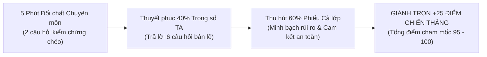
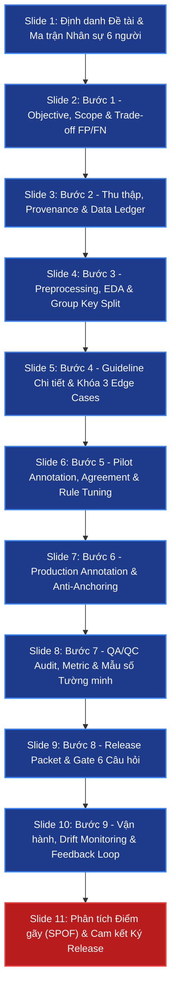
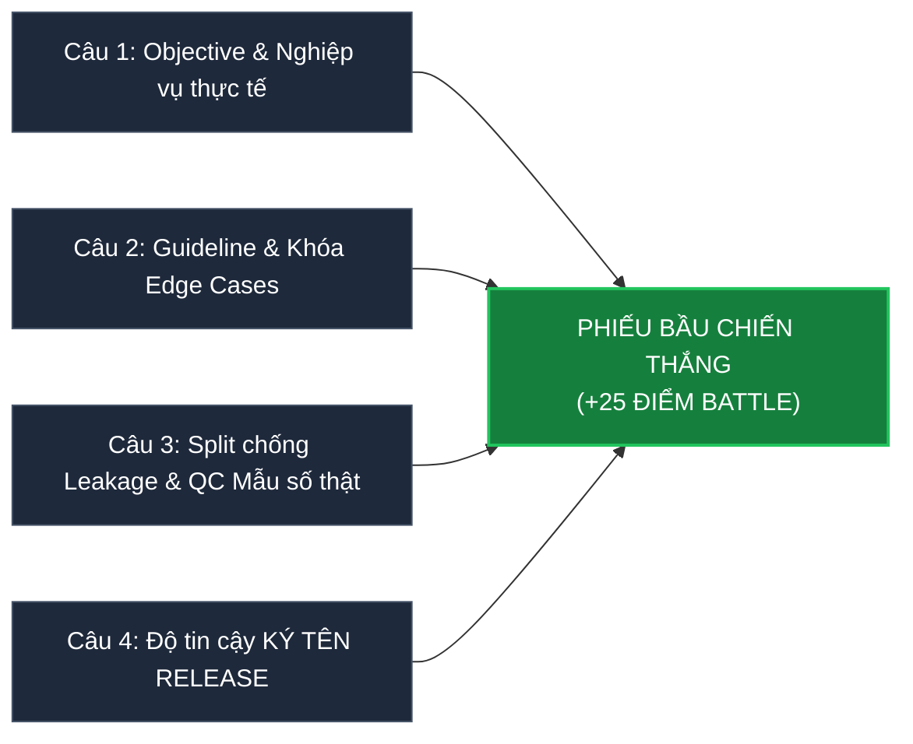

# BỘ CẨM NANG CHIẾN THUẬT BATTLE DATA WORKFLOW & CHUẨN KIỂM ĐỊNH RUBRIC 100 ĐIỂM
**Chương trình:** Khóa học AICB-P2T4 · Bài 06: Quy trình Dữ liệu & Kiểm soát Chất lượng (VinUni & VinAI)  
**Tác giả:** Trưởng ban Đánh giá Chất lượng & Trợ giảng Cấp cao (Master QA Auditor)  
**Áp dụng:** Nhóm 8 · Lớp 2b-d304 (Sĩ số: 6 thành viên) & Bộ khung chuẩn hóa cho mọi đề tài (Đ1, Đ2, Đ3, Đ4)  
**Mục tiêu tối thượng:** Đạt điểm tuyệt đối khung Rubric (65đ Giải pháp + 10đ Thuyết trình), chiến thắng Battle (+25đ), triệt tiêu 100% rủi ro từ 5 Cổng phạt chí mạng.

---

## MỤC LỤC CHIẾN LƯỢC
1. [Giải mã Hệ thống Chấm 100 điểm & Phòng tuyến 5 Cổng phạt](#1-giải-mã-hệ-thống-chấm-100-điểm--phòng-tuyến-5-cổng-phạt)
2. [Bộ Khung Tiêu chuẩn Slide Battle (Slide Template Architecture: 11 Slides Chuẩn)](#2-bộ-khung-tiêu-chuẩn-slide-battle-slide-template-architecture-11-slides-chuẩn)
3. [Slide Structure Checklist: Chi tiết Từng Slide & Nội dung Bắt buộc](#3-slide-structure-checklist-chi-tiết-từng-slide--nội-dung-bắt-buộc)
4. [Bảng Ma trận Phân công 6 Thành viên (Member Matrix · Nhóm 8 Lớp 2b-d304)](#4-bảng-ma-trận-phân-công-6-thành-viên-member-matrix--nhóm-8-lớp-2b-d304)
5. [Bộ Cẩm nang Giải pháp Chuyên sâu Cho Cả 4 Đề tài (Đ1 · Đ2 · Đ3 · Đ4)](#5-bộ-cẩm-nang-giải-pháp-chuyên-sâu-cho-cả-4-đề-tài-đ1--đ2--đ3--đ4)
6. [Kỹ thuật Đối chất 5 Phút: 2 Câu Hỏi Xoáy Điểm Gãy & Phòng thủ 45 Giây Thép](#6-kỹ-thuật-đối-chất-5-phút-2-câu-hỏi-xoáy-điểm-gãy--phòng-thủ-45-giây-thép)
7. [Chiến thuật 4 Câu Bỏ phiếu: Thâu tóm Phiếu Cả lớp và 40% Trọng số Trợ giảng](#7-chiến-thuật-4-câu-bỏ-phiếu-thâu-tóm-phiếu-cả-lớp-và-40-trọng-số-trợ-giảng)
8. [Bộ 6 Câu Hỏi Trợ Giảng Sẽ Chỉ Định Ngẫu Nhiên & Lời Giải Chuẩn](#8-bộ-6-câu-hỏi-trợ-giảng-sẽ-chỉ-định-ngẫu-nhiên--lời-giải-chuẩn)

---

## 1. GIẢI MÃ HỆ THỐNG CHẤM 100 ĐIỂM & PHÒNG TUYẾN 5 CỔNG PHẠT

### 1.1. Cấu trúc Điểm số Thực tế
Hệ thống chấm điểm của Ngày 06 không vận hành theo kiểu "làm đủ bài thì được điểm cao". Điểm số được chia thành 2 cấu phần tách biệt với triết lý thẩm định công nghiệp:

$$\text{Tổng điểm} = \underbrace{\text{Giải pháp + Slide (Tối đa 65đ)} + \text{Thuyết trình (Tối đa 10đ)}}_{\text{Khung Rubric: Tối đa 75 điểm (Chấm liên tục)}} + \underbrace{\text{Thắng Battle (+25đ)}}_{\text{Biểu quyết lớp + TA}}$$

* **Phần Giải pháp + Slide (65đ):** Đánh giá trên 6 trục: **Độ chi tiết · Edge cases · Tính logic xuyên suốt · Cân nhắc team size thực tế · Độ thực chiến · Độ hữu ích**. Đây là phần quyết định sống còn. Slide đẹp mà rỗng tuếch sẽ bị trảm thẳng tay; slide trình bày logic kỹ thuật chặt chẽ, có bảng biểu rõ ràng nhận gì - giao gì - ai làm sẽ ẵm trọn điểm.
* **Phần Thuyết trình (10đ):** Đánh giá việc kiểm soát thời gian 10 phút, phân bổ mạch lạc, toàn bộ thành viên đều làm chủ thiết kế.
* **Thắng Battle (+25đ):** Quyết định bởi biểu quyết 4 câu hỏi đồng thời của cả lớp và Trợ giảng (TA nắm trọng số 40%).
* **Thang bậc phân loại:**
  * **90 – 100đ (Xuất sắc):** Quy trình chi tiết tới mức kỹ sư khác cầm về chạy được ngay; có case khó cụ thể; dám chỉ rõ điểm dễ vỡ nhất và phương án khóa rủi ro. Thường là nhóm thắng battle.
  * **75 – 89đ (Tốt):** Thiết kế chắc tay, logic xuyên suốt, còn vài chỗ chung chung. Nhóm thua battle nhưng bài chắc chắn vẫn nằm ở khung này.
  * **60 – 74đ (Đạt):** Đủ 9 bước nhưng nặng về chép lý thuyết giáo điều, thiếu case khó thực tế, không tính toán nhân lực 6 người.
  * **< 60đ (Cần làm lại):** Sơ sài, thủng logic, vi phạm các cổng phạt.

---

### 1.2. Phòng tuyến Triệt tiêu 5 Cổng Phạt Chí Mạng (Fatal Penalty Gates)

| STT | Cổng Phạt (Fatal Gates) | Mức Phạt | Bản chất Lỗi & Bẫy Tâm lý | Hành động Khóa Rủi ro Tuyệt đối (Zero-Tolerance Policy) |
| :---: | :--- | :---: | :--- | :--- |
| **G1** | **Không nộp slide trước giờ battle** | **DISQUALIFIED** (Loại trực tiếp) | Nước đến chân mới nhảy, cố sửa slide đến giây cuối cùng làm hỏng deadline. | **Chốt nộp trước giờ G 15 phút.** Đúng 1:45 (phút thứ 105 của giờ làm việc), Leader Thành viên 1 khóa slide, xuất file, tải lên hệ thống/gửi TA. Không có ngoại lệ. |
| **G2** | **Slide không phải định dạng PDF** | **-5 ĐIỂM** | Dùng link Canva, Google Slides online dẫn đến lỗi mạng, nhảy font, hoặc không mở được trên máy chiếu phòng D304. | **Chỉ xuất và nộp định dạng `PDF 16:9` chuẩn.** Đặt tên file đúng cú pháp: `Nhom08_Lop2B_D304_DeX.pdf`. Kiểm tra mở offline trên laptop dự phòng trước khi nộp. |
| **G3** | **Quá giờ thuyết trình 10 phút (bị cắt ngang)** | **-5 ĐIỂM** | Nói lan man ở phần giới thiệu; dồn quá nhiều chữ khiến người nói đọc slide; không có đồng hồ căn giờ. | **Áp dụng quy tắc 8:30 Stop.** Thiết kế bài nói tối đa 8 phút 30 giây để dư 1 phút 30 giây đệm an toàn. Thành viên thuyết trình tập dượt với đồng hồ bấm giờ. Hết 8 phút 30 giây là chủ động bấm kết thúc chuyển lượt. |
| **G4** | **Thiếu bảng phân công công việc từng thành viên** | **-10 ĐIỂM** | Quên ghi rõ ai làm gì, để chung chung "cả nhóm cùng làm", vi phạm nguyên tắc truy cứu trách nhiệm. | **Đặt Bảng Ma trận Phân công (Member Matrix) ngay Slide 1 hoặc Slide 2.** Nêu rõ Họ tên, Email VinUni, Vai trò Lifecycle cụ thể, và Trách nhiệm Artifact bàn giao của cả 6 thành viên. |
| **G5** | **1 người gánh team, thành viên khác không trả lời được khi TA chỉ định** | **-10 ĐIỂM** | Nhóm cử 1 bạn giỏi nhất lên nói từ đầu đến cuối; 5 bạn còn lại ngồi im, khi TA gọi ngẫu nhiên thì ấp úng, trả lời sai. | **Chiến thuật "Phân vùng Phòng thủ Cá nhân".** Mỗi thành viên phụ trách độc quyền 1-2 bước trong Lifecycle và 1 câu hỏi tủ của TA. Khi TA gọi ai, người đó lập tức bật mic trả lời rành rọt theo kịch bản đã chuẩn bị. |

---

---

### 1.3. BẢN ĐỒ CHI TIẾT TỪNG TIÊU CHÍ ĐỂ ĐẠT MỨC XUẤT SẮC (90 - 100 ĐIỂM) THEO CHUẨN GRADING RUBRIC

Căn cứ theo tài liệu thẩm định chính thức [`BattleDataWorkflow-grading.md`](https://github.com/hahahuy/K4-L2-DAY06-BattleDataWorkflow/blob/master/BattleDataWorkflow-grading.md), thang điểm 100 được cấu thành từ **75 điểm Rubric kỹ thuật** (chấm liên tục theo mức trần) cộng với **25 điểm Thắng trận Battle**. 

Để đạt ngưỡng **Xuất sắc (90–100 điểm)** — mức điểm cao nhất chỉ dành cho nhóm có *"Quy trình chi tiết tới mức người khác cầm về chạy được, có ca khó cụ thể, và nhóm nói được chỗ nào dễ vỡ"*, Nhóm 8 cần kiểm soát chặt chẽ từng barem điểm thành phần sau:

```
                            TỔNG ĐIỂM BÀI BÁO CÁO (100 ĐIỂM)
  ┌─────────────────────────────────────────────────────────────┬─────────────────────┐
  │                   PHẦN RUBRIC (Tối đa 75 điểm)               │ THẮNG TRẬN (+25đ)   │
  ├─────────────────────────────────────────┬───────────────────┼─────────────────────┤
  │   I. GIẢI PHÁP & SLIDE (Tối đa 65đ)    │ II. THUYẾT TRÌNH  │ III. PHIẾU BẦU      │
  │   • Độ chi tiết (15đ)                   │     (Tối đa 10đ)  │      BATTLE (+25đ)  │
  │   • Xử lý Edge Cases (15đ)              │ • Đúng giờ < 10p  │ • Trọng số TA: 40%  │
  │   • Tính Logic xuyên suốt (10đ)         │   (Quy tắc 8:30)  │ • Phiếu cả lớp: 60% │
  │   • Cân nhắc Team size 6 người (10đ)    │ • Mạch lạc, tự tin│ • Thắng: +25 điểm   │
  │   • Độ thực chiến & Thừa nhận SPOF (10đ)│ • 100% nhóm nắm   │ • Thua: +0 điểm     │
  │   • Độ hữu ích & Tái hiện (5đ)          │   chắc chuyên môn │   (Giữ nguyên 75đ)  │
  └─────────────────────────────────────────┴───────────────────┴─────────────────────┘
```

#### A. Giải phẫu Barem 65 Điểm "Giải pháp & Slide" (Phần nặng nhất)

| Tiêu chí Thẩm định | Thang điểm | Yêu cầu Bắt buộc Để Đạt Điểm Tối Đa | Dấu hiệu Bị Giảm Điểm (Trừ điểm ngầm) |
| :--- | :---: | :--- | :--- |
| **1. Độ chi tiết (Operational Depth)** | **15 điểm** | • Mỗi bước trong 9 bước đều ghi rõ 4 thành tố: **Nhận gì (Input Contract) · Làm gì (Procedure) · Giao gì (Artifact Output) · Cổng nào phải qua (Quality Gate)**.<br>• Có bảng định lượng cụ thể: dung lượng mẫu, định dạng dữ liệu, thời gian SLA.<br>• Không dùng từ ngữ cảm tính như *"gán cẩn thận"*, *"kiểm tra kỹ"*. | • Vẽ sơ đồ 9 ô nhưng mỗi ô chỉ có tên bước.<br>• Không có Gate định lượng (chỉ ghi chung chung "đạt yêu cầu"). |
| **2. Xử lý Ca khó (Edge Case Rigor)** | **15 điểm** | • Nêu đích danh **ít nhất 3 ca khó thực tế** đặc thù của đề tài.<br>• Guideline định nghĩa bằng **dấu hiệu quan sát vật lý (Observable Physical Cues)**, tuyệt đối cấm đoán mò ý định.<br>• Có **Quy tắc Bỏ phiếu trắng (Hard Abstain)** rõ ràng khi thiếu bằng chứng hình học hoặc bị che khuất vượt ngưỡng ($> 70\%$). | • Bỏ qua các ca khó ban đêm, mưa gió, góc khuất, phản quang.<br>• Guideline viết bằng kết luận (ví dụ: *"gán nhãn học sinh mất tập trung khi thấy bạn không chú ý"*). |
| **3. Tính Logic Xuyên suốt (Architectural Consistency)** | **10 điểm** | • Toàn bộ thiết kế từ Bước 2 đến Bước 9 đều phụ thuộc vào **Objective & Ma trận Đánh đổi Asymmetric Cost ($Cost(FN)$ vs $Cost(FP)$) ở Bước 1**.<br>• Ví dụ: Ở Đ1 và Đ3, vì FN nguy hiểm tính mạng $\to$ Bước 7 bắt buộc phải đặt Gate trên **Worst-Class Recall $\ge 99.5\%$**, chấp nhận nới lỏng FPR. | • Mâu thuẫn giữa các bước: Bước 1 tuyên bố tối ưu Recall, nhưng Bước 7 lại lấy Overall Accuracy làm cổng nghiệm thu. |
| **4. Tính Khả thi theo Team Size (Capacity & Ops Planning)** | **10 điểm** | • Bản thiết kế chứng minh rõ nhóm 6 sinh viên vận hành trơn tru: phân định **4 vai trò RACI độc lập** (Annotator, Reviewer, Adjudicator, Data Owner).<br>• Tính toán cụ thể thông lượng (Throughput): thời gian gán/mẫu, kích thước batch ($50 - 250$ mẫu), giới hạn ca làm việc $\le 90$ phút để chống mỏi mắt (Fatigue). | • Quy trình viển vông đòi hỏi 50 annotators hoặc bắt bác sĩ ngồi gán 8 tiếng/ngày.<br>• Người gán batch tự review chính batch của mình. |
| **5. Độ Thực chiến & Thừa nhận SPOF (Production Readiness)** | **10 điểm** | • **"Thừa nhận điểm yếu được cộng điểm, không bị trừ"**: Tự tin chỉ rõ điểm giới hạn vật lý dễ vỡ nhất của hệ thống (Single Point of Failure).<br>• Xây dựng **Kiến trúc Phòng thủ Failsafe 3 Lớp** để khóa đứng rủi ro khi chạy production thực tế. | • Tuyên bố quy trình hoàn hảo 100% không có lỗi.<br>• Lúng túng, chối bỏ khi Trợ giảng chỉ ra điểm gãy kỹ thuật. |
| **6. Độ Hữu ích & Khả năng Tái lập (Reproducibility)** | **5 điểm** | • Release Packet có đầy đủ 5 cấu phần, có mã băm SHA-256 niêm phong dữ liệu.<br>• **Dataset Card** công khai minh bạch các hạn chế kỹ thuật đã biết (Known Limitations) để người dùng downstream không lạm dụng sai mục đích. | • Dataset đóng gói tùy tiện, thiếu tài liệu hướng dẫn, người khác cầm về không thể tái lập thí nghiệm. |

---

#### B. Bí quyết Ẵm Trọn 10 Điểm "Thuyết trình & Làm chủ Thiết kế"

1. **Kiểm soát Khung Giờ Tuyệt Đối (Quy tắc "8:30 Stop"):**
   - Không bao giờ nói quá 9 phút 30 giây để tránh bị chuông báo cắt ngang (-5 điểm).
   - Thiết kế bài nói căn chuẩn **8 phút 30 giây**, dành 1 phút 30 giây cuối làm vùng đệm an toàn và chuyển giao mạch lạc.
2. **Triệt tiêu Hoàn toàn Hiện tượng "1 Người Gánh Team" (Tránh mất 10 điểm):**
   - Slide 1 bắt buộc có bảng **Member Matrix** phân chia 6 thành viên chịu trách nhiệm 6 vùng chuyên môn.
   - Khi bước vào phần hỏi đáp, khi TA gọi ngẫu nhiên bất kỳ ai, thành viên đó chủ động đứng dậy trả lời trong 45 giây theo đúng kịch bản chuyên sâu đã chuẩn bị.

---

#### C. Chiến lược Chiếm trọn +25 Điểm "Thắng Battle"

Trận đấu 30 phút được định đoạt bởi biểu quyết 4 câu hỏi ở 2 phút cuối. Để chiến thắng, nhóm phải đạt được sự đồng thuận của cả lớp và 40% trọng số của Trợ giảng:



1. **Vũ khí Phản biện 5 Phút (Cross-Examination):**
   - Đặt 2 câu hỏi kiểm chứng chéo mang tính chuyên môn cao về **Group Key chống rò rỉ dữ liệu chuỗi thời gian (Buổi 3)** và **Tính tường minh của mẫu số đo lường trong QC (Buổi 2 & 6)**.
   - Đặt câu hỏi với thái độ tôn trọng, mang tính thảo luận học thuật nhưng chạm đúng vào bản chất toán học của mô hình.
2. **Kịch bản 45 Giây Phòng thủ Thép:**
   - Trả lời thẳng vào câu hỏi trong 5 giây đầu tiên.
   - Trích dẫn ngay số liệu thực nghiệm, tên cổng Gate và phương án dự phòng.
   - Kết thúc bằng việc khẳng định tôn chỉ kỹ thuật: *"Thà chậm tiến độ để khắc phục tại khâu QC, tuyệt đối không bao giờ ký release một bộ dữ liệu có rủi ro tiềm ẩn!"*
3. **Thâu tóm 4 Câu Bỏ phiếu Cuối trận:**
   - Khi cả lớp bỏ phiếu cho câu hỏi *"Bạn có dám ký tên chịu trách nhiệm pháp lý vào bản release này không?"*, nhóm nào dám thừa nhận hạn chế, công khai Dataset Card và có quy trình kiểm định độc lập sẽ là nhóm giành được trọn vẹn niềm tin của hội đồng.

---

## 2. BỘ KHUNG TIÊU CHUẨN SLIDE BATTLE (SLIDE TEMPLATE ARCHITECTURE: 11 SLIDES CHUẨN)

Khung slide gồm đúng **11 slides**, tối ưu hóa cho thời lượng trình bày **8 phút 30 giây** (trung bình 45 - 50 giây/slide), bao quát toàn bộ 9 bước Data Lifecycle và đập tan mọi câu hỏi chất vấn.



---

## 3. SLIDE STRUCTURE CHECKLIST: CHI TIẾT TỪNG SLIDE & NỘI DUNG BẮT BUỘC

### Slide 1: Bìa Đề tài & Ma trận Phân công 6 Thành viên (Member Matrix)
* **Tiêu đề lớn:** Tên Đề tài (Đ1/Đ2/Đ3/Đ4) · BẢN THIẾT KẾ QUY TRÌNH DỮ LIỆU & KIỂM SOÁT CHẤT LƯỢNG
* **Định danh:** Nhóm 8 · Lớp 2b-d304 (Phòng D304 · Chiều Thứ 6)
* **Bảng Ma trận Phân công Bắt buộc (Triệt tiêu Cổng G4):**
  * Hiển thị bảng gồm 5 cột: Họ và tên | Email VinUni | Vai trò Lifecycle | Bước Phụ trách | Artifact Bàn giao Chịu trách nhiệm.
  * Ghi rõ: 100% thành viên nắm vững toàn bộ quy trình; mỗi thành viên là Lead Auditor của bước mình phụ trách.

### Slide 2: Bước 1 — Data Objective, Annotation Scope & Trade-off Nghiệp vụ
* **Data Objective chuẩn hóa (Template 3 thành tố):** Phục vụ quyết định [Hành động cụ thể], cho người dùng [Đối tượng sử dụng], tại [Môi trường vận hành], với độ trễ tối đa [X ms/phút].
* **Đơn vị dữ liệu (Unit of Data):** Định nghĩa tường minh (ví dụ: 1 bounding box vật thể/frame; 1 tracklet 3 giây/học sinh; 1 ảnh X-quang/lượt chụp; 1 slot đỗ/frame).
* **Phạm vi gán nhãn (Scope):**
  * *In-scope:* Danh sách class chuẩn xác, không dư thừa.
  * *Out-of-scope:* Liệt kê rõ những đối tượng không gán (để tránh lãng phí ngân sách và nhiễu nhãn).
* **Phân tích Đánh đổi Chí mạng (The Cost of Errors - False Positive vs False Negative):**
  * Khẳng định dứt khoát: **Lỗi nào đắt hơn?**
  * Hệ quả lan tỏa: Quyết định lỗi nào đắt hơn đã làm thay đổi những gì ở: (1) Tiêu chí viết Guideline, (2) Ngưỡng chấp thuận Pilot, (3) Metric và Ngưỡng chặn tại Bước 7 (QC Gate).

### Slide 3: Bước 2 — Thu thập Dữ liệu, Provenance & Data Ledger
* **Chiến lược Thu thập & Phân bổ Hạn ngạch (Quota Allocation):** Bảng hạn ngạch chia theo từng nguồn và từng class, đặc biệt là **Lớp hiếm (Rare Class)** và điều kiện ngoại cảnh khó khăn (ban đêm, mưa, ngược sáng, góc khuất).
* **Sổ cái Dữ liệu (Data Ledger Architecture):** Mỗi file 1 dòng log bất biến: `Record_ID`, `Group_Key`, `Source_URI`, `Timestamp`, `Environmental_Conditions`, `License/Legal_Basis`, `Status (Raw/Quarantine/Eligible)`.
* **Chính sách Cách ly Dữ liệu (Quarantine Policy):** Quy tắc rõ ràng: File hỏng metadata, sai định dạng, thiếu provenance đưa vào vùng cách ly Quarantine; tuyệt đối không xóa im lặng làm sai lệch mẫu số ban đầu.
* **Bảo vệ Bản quyền & Quyền riêng tư (PII & Privacy Compliance):** Biện pháp che mờ khuôn mặt, biển số xe, mã hóa bệnh nhân ngay tại nguồn trước khi chuyển giao cho người gán nhãn.

### Slide 4: Bước 3 — Tiền xử lý, Khám phá Dữ liệu (EDA) & Group Key Split
* **Báo cáo Khám phá Dữ liệu (EDA Highlights):** Phân bố nhãn thực tế, tỷ lệ mất cân bằng giữa các lớp, danh sách ảnh cận trùng lặp (near-duplicates) phát hiện bằng perceptual hash / embedding distance.
* **Quy chuẩn Tiền xử lý (Preprocessing Pipeline):** Chuẩn hóa kích thước, định dạng, color space; toàn bộ biến đổi đều được ghi log vào Ledger.
* **Chiến lược Phân tách Dữ liệu (Stratified Group Split) — Phòng thủ Data Leakage:**
  * **Group Key cụ thể:** Khẳng định Group Key là gì (Chuyến đi / Học sinh / Bệnh nhân / Trạm sạc).
  * **Cơ chế khóa rò rỉ:** Phân chia Train (70%) / Val (15%) / Test (15%) dựa hoàn toàn trên Group Key. 
  * **Gate cam đoan:** Tuyệt đối không có bất kỳ Group Key nào xuất hiện ở cả hai bên split. Test set phản ánh năng lực khái quát hóa trên thực tế, triệt tiêu ảo tưởng "điểm test cao giả".

### Slide 5: Bước 4 — Annotation Guideline & Khóa 3 Edge Cases Chí Mạng
* **Nguyên tắc viết Guideline:** Định nghĩa class hoàn toàn bằng **dấu hiệu quan sát vật lý khách quan (Observable Attributes)**, tuyệt đối không dùng từ ngữ phỏng đoán ý định hoặc kết luận chủ quan.
* **Bảng Khóa 3 Edge Cases Điển hình của Đề tài:**
  * Cột 1: Tình huống ranh giới mập mờ (Ambiguous Case).
  * Cột 2: Quy tắc quyết định nhãn (Decision Rule).
  * Cột 3: Minh chứng trực quan (Visual Positive / Negative counter-example).
* **Quy tắc Abstain (Bỏ phiếu trắng) & Escalate (Chuyển tiếp):** Khi nào được phép abstain (ví dụ: vật thể bị che khuất > 80%, ảnh X-quang hỏng kỹ thuật)? Thủ tục chuyển lên Chuyên gia trưởng giải quyết.
* **Tính Nhất quán Tooling:** Schema trong tool gán nhãn (CVAT/Label Studio) khớp từng ký tự, chữ hoa, nhãn con với Guideline v1.0.

### Slide 6: Bước 5 — Pilot Annotation, Đo Lường Agreement & Tinh chỉnh Rule
* **Quy cách Thử nghiệm Pilot:** Mẫu 30 - 50 ảnh rút từ bộ Eligible, bao gồm đầy đủ tỷ lệ ảnh khó và lớp hiếm; được gán bởi đúng nhân sự sẽ làm batch thật.
* **Thực nghiệm Gán Độc lập kép (Double-Blind Pilot):** 2 annotator gán hoàn toàn độc lập, không xem kết quả của nhau, không trao đổi trong lúc làm.
* **Chỉ số Đồng thuận (Inter-Annotator Agreement - IAA):**
  * Đo lường bằng **Cohen's Kappa ($\kappa$)** cho phân loại và **Intersection over Union (mIoU)** cho bounding box / segmentation.
  * Ngưỡng tối thiểu để Pass Gate Pilot: $\kappa \ge 0.80$, $\text{mIoU} \ge 0.85$.
* **Vòng lặp Nâng cấp (Root Cause Analysis & Rule v2):** Phân tích ma trận bất đồng (Disagreement Matrix) $\to$ Phát hiện rule bị hở $\to$ Ban hành Guideline v1.1 $\to$ Xây dựng bộ ảnh Reference Golden Set phục vụ QC.

### Slide 7: Bước 6 — Quy trình Gán nhãn Hàng loạt (Production Annotation Ops)
* **Kiến trúc Phân vai Tách bạch 4 Cấp bậc (Zero Conflict of Interest):**
  1. *Annotator (Người gán):* Nhận batch theo Group Key, tự kiểm tra checklist trước khi submit.
  2. *Reviewer (Người duyệt):* Độc lập thẩm định; người gán batch A tuyệt đối không được duyệt batch A.
  3. *Adjudicator (Trọng tài chuyên môn):* Trực tiếp giải quyết các ca Escalate mâu thuẫn giữa Annotator và Reviewer.
  4. *Data Owner (Chủ sở hữu dữ liệu):* Giám sát tiến độ, duyệt ngân sách và ký duyệt release.
* **Cơ chế Chống Thiên kiến AI (Anti-Anchoring Bias):** Nếu sử dụng AI Pre-labeling: Annotator buộc phải thực hiện thao tác kiểm tra thủ công, cấm duyệt hàng loạt tự động; ghi rõ cờ `Prelabel_Modified = True/False`.
* **Gate Bàn giao Batch:** Schema validation tự động chặn ngay các file thiếu trường dữ liệu hoặc gán nhãn ngoài guideline.

### Slide 8: Bước 7 — QA/QC Audit, Công thức Đo lường & Mẫu số Tường minh
* **Tách biệt Triệt để 2 Hàng đợi Thẩm định:**
  * **Random Audit Queue:** Rút mẫu ngẫu nhiên có kiểm soát hạt giống (Fixed Random Seed, cỡ mẫu $n \ge 100$ theo công thức Wilson Score / Slovin) $\to$ Dùng để suy diễn thống kê khách quan cho toàn bộ batch.
  * **Risk-based Queue:** Gom các ca tự động nghi ngờ (ảnh chụp đêm, người mới gán, bounding box quá nhỏ) $\to$ Dùng để săn lỗi và sửa lỗi, **tuyệt đối không dùng tỷ lệ lỗi ở hàng đợi này để tính tỷ lệ lỗi toàn batch**.
* **Nguyên tắc "Mẫu số Tường minh":** Tuyệt đối không cộng gộp các tỷ lệ khác mẫu số.
  $$\text{Box Error Rate} = \frac{\text{Số box sai}}{\text{Tổng số box audit}} \quad \ne \quad \text{Image Error Rate} = \frac{\text{Số ảnh sai}}{\text{Tổng số ảnh audit}}$$
* **Báo cáo Đa chiều & Gate Quyết định:** Báo cáo Micro-F1, Macro-F1 và **Worst-Class Precision/Recall**.
  * **Ngưỡng Gate Pass:** Macro-Recall $\ge 95\%$, Worst-Class Recall $\ge 98\%$ (với lớp nguy hiểm). Nếu vi phạm: Trả lại toàn bộ batch, xác định rõ phạm vi gán lại, cấm sửa chữa đối phó vài ảnh.

### Slide 9: Bước 8 — Đóng gói Release Packet & Gate 6 Câu Hỏi Ký Duyệt
* **Bộ 5 Thành phần Bắt buộc của Release Packet v1.0:**
  1. Dữ liệu sạch + Nhãn đã chuẩn hóa (Format COCO/YOLO/Pascal VOC).
  2. File phân tách Split cố định (kèm danh sách Group Key).
  3. Guideline phiên bản chính thức (kèm Decision Log ghi vết thay đổi).
  4. Báo cáo Thẩm định Chất lượng (QC Audit Report với ma trận nhầm lẫn Confusion Matrix).
  5. Dataset Card tiêu chuẩn (Nêu rõ nguồn gốc, hạn ngạch, phân bố và **Đặc biệt là các Hạn chế Đã biết - Known Limitations**).
* **Bảng Kiểm 6 Câu hỏi Phát hành (Sign-off Checklist):** Data Owner Thành viên 1 chỉ ký tên khi cả 6 câu hỏi đều có bằng chứng vật lý trong Packet.
* **Quyết định Dứt khoát:** Đủ bằng chứng $\to$ **RELEASE**; Thiếu bằng chứng $\to$ **HOLD** (kèm biên bản: Thiếu gì, ai bổ sung, thời hạn bao lâu).

### Slide 10: Bước 9 — Giám sát Sau Triển khai, Xử lý Trôi Dữ liệu & Feedback Loop
* **Chiến lược Giám sát Hai Tầng (Production Monitoring):**
  * *Tầng Dữ liệu đầu vào (Data Drift):* Kiểm tra phân bố ảnh thực tế (độ sáng, thời tiết, góc camera mới) so với Dataset ban đầu bằng khoảng cách thống kê (Wasserstein Distance / PSI).
  * *Tầng Kết quả Mô hình (Concept Drift):* Giám sát tỷ lệ can thiệp của con người / tỷ lệ false alarms thực tế.
* **Ma trận Phân tích Lỗi Hồi quy (Root Cause Feedback Matrix):** Khi mô hình chạy thực tế bị sai, lỗi được phân loại chính xác và chỉ đích danh bước cần sửa:
  * Do camera bẩn / góc mới $\to$ Quay lại **Bước 2** (Thu thập thêm dữ liệu trạm mới).
  * Do guideline định nghĩa ranh giới chưa lường hết $\to$ Quay lại **Bước 4 & 5** (Sửa Guideline).
  * Do tỷ lệ lọt lỗi của đợt gán nhãn $\to$ Quay lại **Bước 7** (Nâng ngưỡng Gate QC).
* **Cơ chế Active Learning:** Đẩy tự động các ca tự tin thấp (Low-confidence samples) từ production vào hàng đợi gán nhãn vòng lặp tiếp theo.

### Slide 11: Phân tích Điểm Gãy (SPOF), Đánh giá Độ Thực chiến & Cam kết Release
* **Thừa nhận Điểm Gãy Dễ Vỡ Nhất (Single Point of Failure):** 
  * "Chúng tôi không vẽ ra một quy trình ảo tưởng. Với team 6 người, điểm dễ vỡ nhất là hiện tượng thắt cổ chai tại khâu Review/Adjudication khi chạy đồng thời nhiều batch."
* **Phương án Khóa Rủi ro Dự phòng (Mitigation & Fallback Protocol):** Phân chia ca làm việc lệch pha; áp dụng kiểm định tự động bằng script trước khi người duyệt mở giao diện; chuẩn bị sẵn kịch bản cách ly lỗi cục bộ.
* **Tuyên ngôn Ký Tên Phát hành:** Khẳng định Dataset Packet của nhóm 8 đạt độ tin cậy cấp công nghiệp, có khả năng tái hiện 100%, sẵn sàng để bất kỳ kỹ sư nào ký tên release vào hệ sinh thái thực tế.

---

## 4. BẢNG MA TRẬN PHÂN CÔNG 6 THÀNH VIÊN (MEMBER MATRIX · NHÓM 8 LỚP 2B-D304)

Bảng phân công này được thiết kế theo đúng mô hình phân quyền **Data Governance Cấp Công Nghiệp**, triệt tiêu xung đột lợi ích (Separation of Concerns), đảm bảo 6 thành viên phụ trách 6 mắt xích sống còn:

| STT | Họ và Tên | Email VinUni | Vai trò Lifecycle Chính | Phụ trách Bước | Trách nhiệm Artifact Cụ thể & Vùng Phòng thủ Chất vấn |
| :---: | :--- | :--- | :--- | :---: | :--- |
| **1** | **MẠC PHÚ PHONG** *(Nhóm trưởng)* | `member1@vinuni.edu.vn` | **Data Owner & Lead Release Auditor** | **Bước 1 & Bước 8** | • Chịu trách nhiệm về Data Objective, Unit of Data, Trade-off FP vs FN.<br>• Phê duyệt Release Packet v1.0, ký biên bản Gate hoặc lệnh HOLD.<br>• **Vùng chất vấn TA:** Trả lời Câu hỏi 1 & Câu hỏi 6 (Mục tiêu, Chi phí lỗi, Quyền ký release). |
| **2** | **BÙI THÀNH LONG** | `member2@vinuni.edu.vn` | **Data Collection & Preprocessing Lead** | **Bước 2 & Bước 3** | • Thiết kế Data Ledger, hạn ngạch lớp hiếm, chính sách Quarantine.<br>• Xây dựng đường ống EDA, chuẩn hóa ảnh, xóa trùng lặp (pHash).<br>• Phụ trách chia Stratified Group Split, khóa chống Data Leakage.<br>• **Vùng chất vấn TA:** Trả lời Câu hỏi 4 (Group Key, chống rò rỉ Train/Val/Test). |
| **3** | **DƯƠNG VĂN LONG** | `member3@vinuni.edu.vn` | **Lead Guideline Architect & Domain Specialist** | **Bước 4 & Bước 5** | • Soạn thảo Annotation Guideline bằng dấu hiệu quan sát vật lý.<br>• Định nghĩa bảng quy tắc khóa 3-4 Edge Cases mập mờ, quy tắc Abstain.<br>• Thiết kế cấu hình schema trên công cụ gán nhãn khớp tuyệt đối với rule.<br>• **Vùng chất vấn TA:** Trả lời Câu hỏi 3 (Xử lý các ca khó, ranh giới mập mờ). |
| **4** | **VŨ TÙNG LÂM** | `member4@vinuni.edu.vn` | **Annotation Ops & Tooling Administrator** | **Bước 5 & Bước 6** | • Tổ chức thực nghiệm Pilot kép (Double-blind pilot) trên 30 ảnh khó.<br>• Tính toán chỉ số đồng thuận Inter-Annotator Agreement ($\kappa$, mIoU).<br>• Điều phối batch hàng loạt, kiểm soát Tooling, chặn lỗi AI Anchoring.<br>• **Vùng chất vấn TA:** Trả lời về IAA Pilot, cách chia lô gán nhãn và kiểm soát annotator. |
| **5** | **LÊ CHÍ BẰNG** | `member5@vinuni.edu.vn` | **Lead QA/QC Auditor & Metric Controller** | **Bước 7** | • Thiết lập quy trình Random Audit (seed cố định) và Risk-based Queue.<br>• Tính toán độc lập các mẫu số: Box Error Rate, Macro-Recall, Worst-class Recall.<br>• Ban hành biên bản QC Report, quyết định chấp nhận hoặc trả batch gán lại.<br>• **Vùng chất vấn TA:** Trả lời Câu hỏi 5 (Chỉ số đo chất lượng, mẫu số, quy trình audit). |
| **6** | **NGUYỄN VĂN TUYỂN** | `member6@vinuni.edu.vn` | **MLOps Monitoring & Operations Auditor** | **Bước 9 & Khảo sát SPOF** | • Thiết kế hệ thống giám sát Data Drift & Concept Drift sau triển khai.<br>• Lập ma trận phân tích lỗi hồi quy (Root cause attribution matrix).<br>• Tính toán cân đối nhân sự 6 người, chỉ ra điểm gãy SPOF và giải pháp khắc phục.<br>• **Vùng chất vấn TA:** Trả lời Câu hỏi 6 (Nhân sự vận hành, điểm dễ vỡ nhất khi chạy thật). |

---

## 5. BỘ CẨM NANG GIẢI PHÁP CHUYÊN SÂU CHO CẢ 4 ĐỀ TÀI (Đ1 · Đ2 · Đ3 · Đ4)

Dù bốc thăm vào bất kỳ đề tài nào, nhóm lập tức nạp tham số kỹ thuật tương ứng dưới đây vào slide template:

### ĐỀ TÀI 1: PHÁT HIỆN NGUY CƠ VA CHẠM CHO XE TỰ LÁI (VINFAST)
* **Bối cảnh & Đơn vị dữ liệu:** Camera trước xe VinFast ghi hình liên tục hành trình. Đơn vị dữ liệu: **1 bounding box vật thể 2D/3D trong 1 khung hình (hoặc chuỗi khung hình liên tiếp)**.
* **Objective chuẩn:** Kích hoạt hệ thống phanh khẩn cấp tự động (AEB) / Cảnh báo va chạm phía trước (FCW) / Không can thiệp, trên xe đang lưu thông, từ hình ảnh camera trước, với độ trễ xử lý $\le 200\text{ ms}$.
* **Classes:** `Người đi bộ`, `Xe máy`, `Ô tô`, `Chướng ngại vật tĩnh`. *Out-of-scope:* Đèn giao thông, biển báo, vạch kẻ đường, chim bay, lá rụng.
* **Lỗi nào đắt hơn (Trade-off):** **False Negative (Bỏ sót vật cản) đắt hơn vô hạn lần vì trả giá bằng sinh mạng con người.**
  * *Hệ quả thiết kế:* Đặt ngưỡng Worst-Class Recall cho lớp `Người đi bộ` $\ge 99.5\%$. Chấp nhận False Positive (báo động nhầm) cao hơn một chút ở tầng trinh sát, nhưng xử lý bằng thuật toán Temporal Smoothing (kiểm tra liên tiếp 3 frames) để tránh hiện tượng phanh giật cục (phantom braking).
* **Group Key chống rò rỉ:** **Trip ID / Driving Session (Mỗi chuyến đi / phiên ghi hình là 1 group)**. Tuyệt đối cấm split theo từng khung hình (frame-level split), vì các frame kề nhau giống nhau 99%, nếu frame 1 ở Train và frame 2 ở Test sẽ gây rò rỉ bối cảnh, điểm test cao ảo.
* **Khóa 3 Edge Cases:**
  1. *Vật thể bị che khuất (Occlusion):* Nếu thấy $\ge 20\%$ đặc trưng nhận dạng (đầu/chân người, bánh xe) $\to$ Gán bounding box bao quanh toàn bộ kích thước ước lượng; nếu bị che $> 80\%$ không thể phân biệt $\to$ Out-of-scope.
  2. *Người đi bộ ban đêm / Ngược sáng đèn pha:* Tăng độ sáng cục bộ; quy định gán dựa trên bóng đổ và chuyển động tương đối.
  3. *Xe máy cắt đầu đột ngột (Cut-in):* Gán nhãn ngay khi bánh trước xe máy chạm vạch làn xe mình đang chạy; đánh cờ thuộc tính `cut_in = True`.
* **Pháp lý & PII:** Tự động làm mờ toàn bộ biển số xe và khuôn mặt người đi đường bằng bộ lọc cục bộ trước khi đẩy lên công cụ gán nhãn.

---

### ĐỀ TÀI 2: NHẬN DIỆN HÀNH VI TRONG LỚP HỌC AI THỰC CHIẾN (VINUNI)
* **Bối cảnh & Đơn vị dữ liệu:** Camera đặt cuối giảng đường D303 ghi hình suốt buổi học. Đơn vị dữ liệu: **1 tracklet hành vi kéo dài 3 – 5 giây của 1 sinh viên**.
* **Objective chuẩn:** Tự động ghi nhận điểm danh (Có mặt/Vắng) và phát cảnh báo ẩn cho Giảng viên/TA khi tỷ lệ mất tập trung của lớp vượt quá 40% trong 15 phút liên tục, tại phòng D303.
* **Classes:** `Đang nghe giảng/ghi chép`, `Dùng điện thoại`, `Ngủ gật`, `Trao đổi nhóm`, `Rời chỗ`. *Out-of-scope:* Giảng viên, TA đi lại trong lớp, bóng người qua cửa sổ.
* **Lỗi nào đắt hơn (Trade-off):** **False Positive (Gán nhầm sinh viên chăm chỉ thành ngủ gật / dùng điện thoại) đắt hơn vì gây oan sai, xúc phạm sinh viên và hủy hoại niềm tin vào công nghệ.**
  * *Hệ quả thiết kế:* Guideline phải cực kỳ khắt khe; chỉ gán `Dùng điện thoại` khi có bằng chứng không thể chối cãi. Trường hợp mập mờ phải ưu tiên gán nhãn mặc định là `Đang nghe giảng/ghi chép` hoặc `Abstain`.
* **Group Key chống rò rỉ:** **Student ID + Buổi học**. Tuyệt đối không để hình ảnh của cùng 1 sinh viên xuất hiện ở cả tập Train và tập Test (mô hình sẽ học vẹt quần áo, kiểu tóc của sinh viên đó).
* **Khóa 3 Edge Cases:**
  1. *Cúi đầu chép bài vs Cúi đầu bấm điện thoại:* Nếu hai tay để trên mặt bàn cầm bút/vở $\to$ Gán `Đang nghe giảng`; chỉ gán `Dùng điện thoại` khi nhìn thấy rõ thiết bị hoặc ánh sáng màn hình phản chiếu lên mặt/ngực.
  2. *Chống tay lên cằm suy nghĩ vs Ngủ gật:* Nếu mắt nhắm liên tục $> 10\text{ giây}$ hoặc đầu gục hẳn xuống bàn $\to$ Gán `Ngủ gật`; nếu mắt vẫn hướng lên bảng/màn hình $\to$ Gán `Đang nghe giảng`.
  3. *Sinh viên ngồi bàn sau bị che khuất bởi sinh viên bàn trước:* Nếu phần cơ thể quan sát được $< 30\%$, không thể xác định hành vi $\to$ Đánh cờ `Abstain / Occluded`.
* **Pháp lý & Quyền riêng tư (Tối quan trọng):** Dữ liệu sinh viên nội bộ. Bắt buộc có: Bản cam kết đồng ý (Informed Consent Form) của sinh viên lớp 2B; toàn bộ khuôn mặt sinh viên được ẩn danh hóa bằng mã định danh ngẫu nhiên (UUID); cấm sử dụng nhận diện danh tính cho mục đích trừng phạt cá nhân.

---

### ĐỀ TÀI 3: SÀNG LỌC BẤT THƯỜNG TRÊN ẢNH X-QUANG NGỰC (VINMEC)
* **Bối cảnh & Đơn vị dữ liệu:** Bệnh viện Vinmec tiếp nhận hàng trăm ca chụp X-quang phổi mỗi ngày. Đơn vị dữ liệu: **1 ảnh X-quang ngực thẳng (CXR DICOM) của 1 lượt chụp**.
* **Objective chuẩn:** Phân loại tự động để đẩy các ca nghi ngờ bất thường nguy hiểm lên đầu danh sách đọc ưu tiên của Bác sĩ Chẩn đoán hình ảnh, giảm thời gian chờ đợi cho ca cấp cứu từ 45 phút xuống dưới 10 phút.
* **Classes:** `Bình thường`, `Nghi ngờ bất thường`, `Không đọc được (Lỗi kỹ thuật)`. *Out-of-scope:* Chẩn đoán tên bệnh học chi tiết (u ác, lao, viêm phổi mô kẽ) — việc này để bác sĩ chuyên khoa kết luận.
* **Lỗi nào đắt hơn (Trade-off):** **False Negative (Bỏ sót bệnh nhân có tổn thương nặng, coi là bình thường) là thảm họa y khoa dẫn tới tử vong.**
  * *Hệ quả thiết kế:* Đặt Sensitivity (Recall) cho lớp `Nghi ngờ bất thường` $\ge 99.0\%$. Chấp nhận False Positive (ảnh bình thường nhưng bị gắn cờ nghi ngờ) để bác sĩ kiểm tra lại, phương châm y tế: "Thà kiểm tra nhầm còn hơn bỏ sót".
* **Group Key chống rò rỉ:** **Patient ID (Mã bệnh nhân)**. Một bệnh nhân có thể chụp nhiều lần ở các ngày khác nhau. Cùng 1 Patient ID mà chia sang cả Train và Test sẽ làm mô hình ghi nhớ cấu trúc giải phẫu riêng của lồng ngực bệnh nhân đó, dẫn đến overfitting nghiêm trọng.
* **Khóa 3 Edge Cases & Thách thức Bác sĩ:**
  1. *Ảnh lỗi kỹ thuật (Cử động khi chụp, hít vào chưa đủ sâu, dị vật kim loại/dây chuyền che phổi):* Gán dứt khoát vào class `Không đọc được (Lỗi kỹ thuật)` $\to$ Yêu cầu chụp lại, tuyệt đối cấm đoán mò.
  2. *Tổn thương mờ nhạt vùng đỉnh phổi / Sau bóng tim:* Bắt buộc xem xét trên màn hình y tế chuẩn DICOM 10-bit; nếu không chắc chắn $\to$ Kích hoạt rule `Abstain` để chuyển hội chẩn.
  3. *Bác sĩ annotator khan hiếm (Chỉ có 2 giờ/tuần):* Thiết kế quy trình gán phân tầng: Kỹ thuật viên lọc sơ bộ $\to$ Bác sĩ chuyên khoa gán độc lập kép trên mẫu khó $\to$ Nếu 2 bác sĩ bất đồng $\to$ Bác sĩ Trưởng khoa đóng vai trò Adjudicator ra quyết định cuối cùng.
* **Pháp lý & HIPAA:** 100% dữ liệu phải là bộ ảnh công khai đã De-identified chuẩn HIPAA hoặc ảnh nội bộ đã tẩy sạch toàn bộ trường metadata cá nhân (Tên, Ngày sinh, Mã hồ sơ y tế). Tuyệt đối không mang dữ liệu ra khỏi máy chủ Vinmec.

---

### ĐỀ TÀI 4: GIÁM SÁT TRẠM SẠC XE ĐIỆN (V-GREEN · VINFAST)
* **Bối cảnh & Đơn vị dữ liệu:** Camera an ninh góc cao gắn tại các trạm sạc V-Green toàn quốc. Đơn vị dữ liệu: **1 ô đỗ trụ sạc trong 1 khung hình (Slot-level status)**.
* **Objective chuẩn:** Phát hiện tự động và gửi cảnh báo đến Đội vận hành trạm sạc / Kích hoạt loa nhắc nhở tài xế / Tính phí chiếm chỗ tự động, khi ô sạc bị xe xăng chiếm hoặc xe điện sạc xong chiếm chỗ quá 15 phút.
* **Classes:** `Đang sạc hợp lệ`, `Xe chiếm chỗ không sạc`, `Ô trống`, `Trụ sạc/Cáp bị hỏng`. *Out-of-scope:* Người đứng gần xe, xe lưu thông ngang qua không đỗ, thời tiết mưa bão.
* **Lỗi nào đắt hơn (Trade-off):** **False Positive (Phạt nhầm xe đang sạc hợp lệ thành xe chiếm chỗ) đắt hơn vì gây bức xúc khách hàng, khủng hoảng truyền thông thương hiệu.**
  * *Hệ quả thiết kế:* Quy định thời gian đệm (Grace period 15 phút); Guideline quy định chỉ phạt khi có đủ 2 bằng chứng: (1) Xe đỗ trong ô và (2) Cáp sạc không cắm hoặc đèn led báo sạc trên trụ đã chuyển sang trạng thái đã sạc xong/standby liên tục trong 3 chu kỳ kiểm tra.
* **Group Key chống rò rỉ:** **Trạm sạc + Phiên đỗ (Station ID + Parking Session)**. Không split theo khung hình vì cùng 1 chiếc xe đỗ 2 tiếng sẽ sinh ra hàng nghìn frame giống nhau. Split phải theo cụm Trạm sạc để kiểm tra khả năng thích ứng với góc quay và ánh sáng trạm mới.
* **Khóa 3 Edge Cases:**
  1. *Phân biệt "Đang sạc" vs "Đỗ chiếm chỗ không sạc" (Ca khó nhất):* Bắt buộc kiểm tra 2 dấu hiệu vật lý: Cáp sạc có được cắm vào cổng sạc trên thân xe không? Đèn tín hiệu trên trụ sạc có hiển thị trạng thái sạc (màu xanh lá nhấp nháy) không? Nếu cáp vắt vẻo trên trụ hoặc cắm xuống đất $\to$ Gán `Chiếm chỗ`.
  2. *Xe xăng đỗ vào ô sạc:* Nhận diện đầu xe không có cổng sạc hoặc logo xe không phải xe điện $\to$ Gán ngay `Chiếm chỗ trái phép`.
  3. *Ban đêm, đèn pha xe khác quét qua làm lóa camera hoặc mưa phủ mờ ống kính:* Đánh cờ thuộc tính `Visibility_Degraded`; nếu không nhìn rõ vạch ô và cổng sạc $\to$ Gán nhãn `Không xác định (Escalate)`.
* **Vận hành & Concept Drift (Bước 9):** Khi V-Green nâng cấp trụ sạc mới (trụ siêu nhanh 250kW có kiểu dáng cáp và đèn báo khác trụ 60kW), hệ thống phải phát hiện Out-of-distribution (OOD) để đẩy về Bước 2 và 4 bổ sung dữ liệu.

---

## 6. KỸ THUẬT ĐỐI CHẤT 5 PHÚT: 2 CÂU HỎI XOÁY ĐIỂM GÃY & PHÒNG THỦ 45 GIÂY THÉP

Trong 5 phút đối chất, mỗi nhóm được bắn **2 câu hỏi** và phải trả lời trong **45 giây/câu**. Đây là nơi định đoạt điểm số và lật ngược tình thế.

### 6.1. Bắn 2 Phát Súng Hạ Gục Đối Thủ (Offensive Strategy)
Tùy vào đề tài của trận đấu, người chất vấn của Nhóm 8 đứng dậy, nói to, dõng dạc, bắn thẳng vào 2 tử huyệt mà 90% các nhóm sinh viên đều mắc phải:

#### CÂU HỎI 1: Bẫy Điểm Test Ảo do Data Leakage (Bắn thẳng vào Bước 3)
> *"Xin hỏi nhóm đối thủ: Các bạn chia train/validation/test dựa trên tiêu chí nào? Nếu các bạn chia ngẫu nhiên theo khung hình (random frame split) mà không gom nhóm theo [Group Key: Chuyến đi / Học sinh / Bệnh nhân / Trạm sạc], các bạn có nhận thức được rằng mô hình của các bạn chỉ đang học vẹt bối cảnh và điểm test 95% hoàn toàn là 'điểm số dối trá' do rò rỉ dữ liệu hay không? Xin mời chỉ rõ Group Key của các bạn!"*

* **Mục đích:** Khiến đối thủ lúng túng thừa nhận họ chia ngẫu nhiên $\to$ Lộ ngay lỗi cơ bản nhất trong xử lý Computer Vision $\to$ Toàn bộ kết quả của họ mất giá trị.

#### CÂU HỎI 2: Bẫy Số Liệu Đẹp Ảo & Mẫu Số Ma trong QC (Bắn thẳng vào Bước 7)
> *"Khi nhóm bạn tự tin công bố tỷ lệ chính xác 98% ở khâu QC, xin cho biết mẫu số của tỷ lệ này là gì? Các bạn đo trên Random Audit hay Risk Queue? Và quan trọng nhất: Với lớp nguy hiểm nhất là [Người đi bộ đêm / Bỏ sót u phổi / Xe chiếm chỗ], Recall đạt bao nhiêu? Nếu mô hình bỏ sót 2% ở lớp này trong vận hành thực tế, hậu quả chết người/pháp lý sẽ được ai ký chịu trách nhiệm?"*

* **Mục đích:** Bóc trần việc đối thủ dùng tỷ lệ Micro-average để che giấu việc bỏ sót lớp hiếm/lớp nguy hiểm, hoặc nhầm lẫn giữa mẫu số của ảnh và mẫu số của vật thể.

---

### 6.2. Kịch bản Phòng thủ Thép 45 Giây (Defensive Protocol: 15s – 20s – 10s)
Khi bị đối thủ hoặc TA chất vấn, thành viên được chỉ định của Nhóm 8 lập tức đứng dậy, nhìn thẳng vào người hỏi, trả lời dứt khoát theo công thức **3 Khối Thời Gian**:

```
[00s - 15s] TRỰC DIỆN & THỪA NHẬN THỰC TẾ
"Cảm ơn câu hỏi của nhóm bạn. Nhóm 8 xác định ngay từ đầu đây là một đánh đổi kỹ thuật có chủ đích, không phải thiếu sót..."

[15s - 35s] ĐƯA BẰNG CHỨNG SỐ LIỆU & QUY TRÌNH CHẶN
"Như đã trình bày ở Slide [X], để chống rò rỉ, chúng tôi dùng Group Key là [Y], khóa cứng ở Bước 3. Ở khâu QC Bước 7, mẫu số của chúng tôi được định nghĩa độc lập cho từng class, tách rời hoàn toàn giữa Random Audit (seed cố định) và Risk Queue. Ngưỡng Worst-Class Recall của chúng tôi được chốt ở mức 98.5%..."

[35s - 45s] CHỐT HẠ BẰNG TINH THẦN THỰC CHIẾN
"Nếu vi phạm ngưỡng này, Data Owner Thành viên 1 sẽ bấm lệnh HOLD toàn bộ batch theo đúng Gate Bước 8. Chúng tôi thà chậm tiến độ chứ không phát hành một dataset rác!"
```

---

## 7. CHIẾN THUẬT 4 CÂU BỎ PHIẾU: THÂU TÓM PHIẾU CẢ LỚP VÀ 40% TRỌNG SỐ TRỢ GIẢNG

Cả lớp và TA sẽ giơ phiếu biểu quyết đồng thời cho 4 câu hỏi cốt lõi để quyết định ai được nhận **+25 điểm Thắng Battle**. Nhóm 8 phải định hình suy nghĩ của người nghe ngay trong bài nói 10 phút để họ tự động giơ phiếu cho mình:



### 4 Câu Hỏi Bỏ Phiếu & Đòn Tâm Lý Lôi Kéo Của Nhóm 8:

1. **Câu 1: Nhóm nào có Data Objective và Scope rõ ràng, gắn chặt với quyết định thực tế hơn?**
   * *Đòn tâm lý Nhóm 8:* Nhấn mạnh vào câu hỏi "Dataset này sinh ra để phục vụ ai, quyết định cái gì trong bao nhiêu mili giây?". Đối thủ chỉ nói "để nhận diện xe/người", còn Nhóm 8 nói rõ "để kích hoạt phanh khẩn cấp dưới 200ms".
2. **Câu 2: Nhóm nào có Annotation Guideline chi tiết, giải quyết các ca khó (Edge cases) thuyết phục hơn?**
   * *Đòn tâm lý Nhóm 8:* Chiếu thẳng Slide 5 với bảng 3 Edge cases cụ thể bằng dấu hiệu quan sát vật lý. Nhắc nhở người nghe: "Các bạn có muốn annotator của mình phải ngồi đoán mò ý định không? Guideline của chúng tôi biến người mới thành thợ gán lành nghề".
3. **Câu 3: Nhóm nào có chiến lược Split chống rò rỉ dữ liệu và phương pháp đo QC trung thực với mẫu số tường minh?**
   * *Đòn tâm lý Nhóm 8:* Chỉ trích mạnh mẽ tư duy làm đẹp số liệu. Khẳng định: "Chúng tôi dùng Group Key để điểm test là điểm thật. Chúng tôi không giấu lỗi đằng sau chỉ số trung bình Micro, mà công khai Worst-class Recall".
4. **Câu 4 (Câu Quyết Định): Nếu phải chịu trách nhiệm pháp lý và sản phẩm, bạn DÁM KÝ TÊN RELEASE bộ dữ liệu của nhóm nào?**
   * *Đòn tâm lý Nhóm 8 (Kết bài thuyết trình):* 
     > *"Thưa các bạn và các Trợ giảng: Một bản thiết kế hoàn hảo trên giấy không cứu được người khi xe tự lái gặp tai nạn, không giúp bác sĩ tránh chẩn đoán sai, không bảo vệ được quyền riêng tư của chính các bạn trong lớp học này. Nhóm 8 mang đến một quy trình có chữ ký, có cổng chặn, có trách nhiệm cá nhân của từng người. Khi cầm lá phiếu trên tay, hãy hỏi chính mình: Bạn có dám ký tên chịu trách nhiệm vào bản release của đối thủ không? Hay bạn sẽ chọn sự an toàn tuyệt đối từ bản thiết kế của Nhóm 8?"*

---

## 8. BỘ 6 CÂU HỎI TRỢ GIẢNG SẼ CHỈ ĐỊNH NGẪU NHIÊN & LỜI GIẢI CHUẨN

Trong 3 phút chất vấn của Trợ giảng (TA), TA sẽ **chọn ngẫu nhiên một thành viên bất kỳ** (không phải người thuyết trình). Dưới đây là ma trận câu hỏi và kịch bản phân công ứng đáp:

### Câu 1: "Dataset này phục vụ quyết định nào — ai dùng, dùng để làm gì?"
* **Người trả lời chỉ định:** **MẠC PHÚ PHONG** (hoặc thành viên bất kỳ được gọi).
* **Lời giải chuẩn:** "Thưa TA, dataset của nhóm phục vụ quyết định [Nêu hành động cụ thể ở Bước 1]. Người dùng trực tiếp là [Hệ thống điều khiển xe / Giảng viên / Bác sĩ chẩn đoán / Đội vận hành trạm sạc]. Nó không phải là một mô hình chung chung, mà giải quyết đúng bài toán [Nêu bài toán] với ràng buộc độ trễ là [X ms/giây]. Toàn bộ 8 bước phía sau được thiết kế xoay quanh quyết định này."

### Câu 2: "Lỗi nào đắt hơn, false positive hay false negative, và điều đó đã làm thay đổi những gì ở các bước sau?"
* **Người trả lời chỉ định:** **MẠC PHÚ PHONG** hoặc **LÊ CHÍ BẰNG**.
* **Lời giải chuẩn:** "Thưa TA, với đề tài của chúng em, [False Negative / False Positive] đắt hơn vượt trội vì [Nêu hệ quả: sinh mạng con người / oan sai sinh viên / chẩn đoán nhầm / bức xúc khách hàng]. Quyết định này đã thay đổi 3 mắt xích trong lifecycle:
  1. Ở Bước 4: Guideline siết chặt định nghĩa class nguy hiểm bằng dấu hiệu quan sát khắt khe.
  2. Ở Bước 5: Ngưỡng đồng thuận Pilot nâng lên $\ge 0.85$ riêng cho class này.
  3. Ở Bước 7: Cổng Gate QC không xét điểm trung bình mà đặt ngưỡng Worst-Class Recall phải đạt $\ge 98.5\%$."

### Câu 3: "Guideline của nhóm xử lý ca khó nào, và xử lý ra sao?"
* **Người trả lời chỉ định:** **DƯƠNG VĂN LONG** (Lead Guideline).
* **Lời giải chuẩn:** "Thưa TA, ca khó nhất của đề tài này là [Nêu ca khó: xe cắt đầu / cúi đầu dùng điện thoại / tổn thương mờ / xe đỗ chiếm chỗ nhưng chưa cắm cáp]. Nhóm em xử lý bằng nguyên tắc dấu hiệu quan sát vật lý tại Slide 5: Chúng em không đoán ý định, mà quy định [Nêu dấu hiệu nhận biết cụ thể]. Nếu rơi vào vùng mờ không thể xác định, annotator kích hoạt rule Abstain để đẩy lên Adjudicator, tuyệt đối không được đoán mò."

### Câu 4: "Group key là gì, và chống rò rỉ giữa train với test bằng cách nào?"
* **Người trả lời chỉ định:** **BÙI THÀNH LONG** (Data Preprocessing Lead).
* **Lời giải chuẩn:** "Thưa TA, Group Key của nhóm em là [Trip ID / Student ID / Patient ID / Station ID]. Chống rò rỉ bằng cách: Tại Bước 3, chúng em nhóm toàn bộ các record có chung Group Key lại thành một cụm trước khi chia split. Toàn bộ một cụm chỉ được nằm trọn vẹn ở Train HOẶC Val HOẶC Test. Chúng em kiểm tra bằng script tự động kiểm tra giao thoa tập hợp, đảm bảo rò rỉ bằng 0%."

### Câu 5: "Đo chất lượng bằng chỉ số gì, trên mẫu bao nhiêu, ai là người đo?"
* **Người trả lời chỉ định:** **LÊ CHÍ BẰNG** (Lead QA/QC Auditor).
* **Lời giải chuẩn:** "Thưa TA, chất lượng được đo bởi Reviewer độc lập (không phải người vừa gán batch đó). Chúng em rút mẫu Random Audit $n \ge 100$ ảnh với hạt giống seed ngẫu nhiên cố định để đảm bảo tính tái hiện. Chỉ số đo lường là Macro-Recall và Worst-Class Recall, với mẫu số tường minh được tính độc lập theo từng loại lỗi, tách rời khỏi Risk Queue. Cổng Gate yêu cầu Worst-Class Recall $\ge 98.5\%$; nếu không đạt, batch bị bác bỏ toàn bộ."

### Câu 6: "Quy trình này cần bao nhiêu người, và chỗ nào dễ vỡ nhất khi chạy thật?"
* **Người trả lời chỉ định:** **NGUYỄN VĂN TUYỂN** hoặc **VŨ TÙNG LÂM**.
* **Lời giải chuẩn:** "Thưa TA, quy trình này được tối ưu hóa cho đúng 6 người của Nhóm 8 với 4 vai trò độc lập theo Slide 1. Chỗ dễ vỡ nhất khi chạy thật chính là khâu Review và Thẩm định bất đồng (Adjudication) — khi các batch dồn về cùng lúc sẽ gây thắt cổ chai, khiến reviewer mệt mỏi và dễ chấp nhận lỗi AI pre-label (hiện tượng anchoring). Nhóm em khắc phục bằng cách: Thiết lập script tự động kiểm tra schema trước khi người duyệt mở ảnh, và quy định thời gian làm việc ngắt quãng không quá 90 phút liên tục để giữ tỉnh táo."

---

## 9. CHECKLIST BỎ TÚI TRƯỚC GIỜ G (PRE-FLIGHT CHECKLIST)

```markdown
[ ] 1. Slide xuất đúng định dạng PDF 16:9? (Tên file: Nhom08_Lop2B_D304_DeX.pdf)
[ ] 2. Đã nộp slide lên hệ thống trước 15 phút so với giờ battle?
[ ] 3. Slide 1 có đầy đủ bảng phân công 6 thành viên kèm vai trò Lifecycle?
[ ] 4. Đã phân công cụ thể người thuyết trình chính (bấm giờ thử dưới 8 phút 30 giây)?
[ ] 5. Toàn bộ 6 thành viên đã thuộc lòng câu hỏi tủ của mình theo Mục 8?
[ ] 6. Người bắn câu hỏi đối chất đã chuẩn bị sẵn 2 câu hỏi xoáy tại Mục 6?
[ ] 7. Mở sẵn file PDF trên laptop, ngắt kết nối mạng/thông báo để sẵn sàng chiếu offline?
```

> **LỜI KẾT TỪ MASTER QA AUDITOR:**  
> *"Chiến thắng trong Data Workflow Battle không đến từ những slide bóng bẩy chứa đầy buzzwords của AI. Nó đến từ sự trung thực trong kỹ thuật, sự chặt chẽ trong logic phân tách dữ liệu, và bản lĩnh dám nhận trách nhiệm về từng con số. Hãy bước lên sàn đấu với tâm thế của những kỹ sư trưởng thực thụ!"*


### 6.3. CHIẾN THUẬT BATTLE TỐI ƯU HÓA TỪ AGENT CHIẾN LƯỢC
**Vũ khí Phản biện Cải tiến (Đòi hỏi chính xác thông số - Không thể né tránh):**


- **Bẫy Vi phạm Hợp đồng Dữ liệu (Data Contract - Buổi 6):** *"Quy trình của nhóm có cơ chế 'Hợp đồng dữ liệu' (Contract) giữa khâu Thu thập và Gán nhãn không? Nếu batch dữ liệu bị thiếu trường Provenance hoặc sai định dạng, khâu Gán nhãn của nhóm sẽ xử lý thế nào? Nhóm có dám 'Reject Handoff' và đẩy batch đó vào vùng Quarantine (Cách ly) không, hay vẫn cắm cúi gán nhãn tiếp?"*
- **Bẫy Lát cắt Dữ liệu (Slice-based Evaluation - Buổi 6):** *"Mức điểm mAP/Accuracy chung của nhóm là vô nghĩa nếu hệ thống sụp đổ ở các ca khó. Nhóm đã chia 'Slice' (lát cắt) dữ liệu như thế nào để test riêng rẽ các trường hợp (ví dụ: góc khuất, mưa đêm)? Điểm số cụ thể trên Slice khó nhất của nhóm là bao nhiêu?"*

- **Bẫy Bounding Box (Buổi 5 - Segmentation):** *"Một chiếc xe máy ôm cua hoặc một sợi dây cáp sạc cong, nếu vẽ Bounding Box thì 60-90% diện tích box là background (mặt đường). Nhóm làm thế nào để model không học nhầm 'nhựa đường là một phần của xe'? Tại sao nhóm không dùng Panoptic Segmentation (kết hợp Instance cho Things và Semantic cho Stuff) để tối ưu hóa Pixel-level accuracy?"*- **Bẫy Data Leakage (Buổi 3):** *"Nhóm đã dùng chính xác 'Group Key' nào để chia dataset? Nếu nhóm chỉ chia ngẫu nhiên (random split) mà không có khóa theo thời gian/không gian, nhóm giải thích thế nào về tính hợp lệ của Test Score khi chắc chắn đã xảy ra rò rỉ các frame gần giống nhau (near-duplicates) giữa Train và Test?"*
- **Bẫy Vanity Metric (Buổi 2 & 6):** *"Chỉ số mAP hoặc Accuracy trung bình sẽ che đậy tỷ lệ lỗi của các class hiếm nhưng cực kỳ nguy hiểm. Xin nhóm cho biết chính xác Worst-Class Recall của class quan trọng nhất là bao nhiêu, và mẫu số (denominator) nhóm dùng để tính ra con số đó được lấy từ Random Audit hay Risk Queue?"*

**Kịch bản 45 Giây Phòng thủ Thép Cải tiến (Bỏ chào hỏi - Khẳng định Quyền lực RACI):**
- **[0s - 10s] Khẳng định Trực diện:** *"Đây không phải lỗi, đây là sự đánh đổi Asymmetric Cost có chủ đích. Nhóm chấp nhận hi sinh False Positive để triệt tiêu False Negative, vì cái giá phải trả cho FN ở đề tài này là tai nạn/nhân mạng."*
- **[10s - 30s] Bằng chứng Toán học & Vai trò RACI:** *"Với tư cách là [Ví dụ: Lead QA/QC Thành viên 5 / Data Owner Thành viên 1], tôi đã thiết lập cổng Gate ép Worst-Class Recall phải đạt 99.5%. Mẫu số QC của chúng tôi được bóc tách độc lập hoàn toàn bằng Fixed-seed Random Audit, không bị lẫn với Risk Queue."*
- **[30s - 45s] Tối hậu thư Sản xuất:** *"Nếu batch nào rớt dưới 99.5% Worst-Class Recall, Data Owner sẽ lập tức ký HOLD. Chúng tôi thà đình trệ tiến độ để sửa dữ liệu, chứ tuyệt đối không dùng metric trung bình để lấp liếm lỗi và release một bộ dữ liệu nguy hiểm."*


### 6.4. KỊCH BẢN BATTLE ĐỘT PHÁ (TÍCH HỢP DATA CONTRACT & SLICE-LEVEL EVALUATION TỪ BÀI 6)

#### A. 2 CÂU HỎI TẤN CÔNG (Dành cho 5 Phút Cross-Examination)

**CÂU HỎI 1: Sụp Đổ Khế Ước Dữ Liệu (Contract Violation) & Bẫy Data Leakage**
> *"Xin hỏi nhóm đối thủ: Trong Data Pipeline, 'Khế ước Dữ liệu' (Data Contract) giữa khâu Collect và Annotate của các bạn được quy định như thế nào? Nếu dữ liệu từ Collect đẩy sang bị thiếu Provenance hoặc sai metadata, khâu Annotate có quyền REJECT toàn bộ batch như một 'Contract Violation' không, hay các bạn vẫn nhắm mắt gán nhãn? Nếu không có cơ chế reject chặn lỗi giữa các khâu, toàn bộ dữ liệu phía sau chỉ là rác. Ai sẽ chịu trách nhiệm cho sự sụp đổ khế ước này?"*

**CÂU HỎI 2: Ảo Tưởng Global Metrics & Đánh Giá Lát Cắt (Slice-level Evaluation)**
> *"Nhóm bạn tự hào với độ chính xác 98% ở khâu QC, nhưng Global Metrics trung bình chỉ là con số vô nghĩa (Vanity Metric) che đậy rủi ro. Chuẩn Lesson 6 bắt buộc dùng 'Slice-level evaluation' (Đánh giá theo lát cắt). Xin hỏi: Với Data Slice chứa các ca khó (edge cases) có Asymmetric Cost cao nhất, Worst-Class Recall của các bạn chính xác là bao nhiêu? Nếu QC lọt lỗi trên lát cắt này, hậu quả kinh doanh/nhân mạng sẽ ra sao?"*

#### B. KỊCH BẢN 45 GIÂY PHÒNG THỦ THÉP (Chống đỡ 6 câu hỏi của TA)

**[00s - 15s] Trực diện Bác bỏ Global Metrics:**
> *"Đây không phải lỗi, đây là sự đánh đổi Asymmetric Cost có chủ đích được chốt chặt vào Data Contract từ Bước 1. Nhóm 8 loại bỏ hoàn toàn Global Metrics ảo tưởng dùng để lấp liếm sai số, bởi rủi ro chết người luôn nằm ở các lát cắt dữ liệu hẹp."*

**[15s - 30s] Bằng chứng Slice-level Evaluation & Quyền Reject (Contract Violation):**
> *"Với tư cách là [Tên & Vai trò RACI], tôi áp dụng 'Slice-level evaluation' độc lập trên từng cụm rủi ro. Bất kỳ batch dữ liệu nào đẩy từ khâu Collect sang Annotate mà thiếu Provenance, hoặc từ Annotate sang QC vi phạm Guideline, đều cấu thành 'Contract Violation' (Vi phạm khế ước). Khâu tiếp theo sẽ lập tức REJECT toàn bộ batch trả về. Chúng tôi ép Worst-Class Recall của lát cắt khó nhất đạt 99.5%."*

**[30s - 45s] Chốt hạ bằng Lệnh HOLD Sản xuất:**
> *"Khi xảy ra 'Contract Violation' giữa bất kỳ khâu nào, Data Owner Thành viên 1 sẽ lập tức ký lệnh HOLD đưa vào Quarantine (Cách ly). Chúng tôi thà đập bỏ batch lỗi và đóng băng tiến độ, chứ tuyệt đối không ký Release một bộ dữ liệu rác!"*
