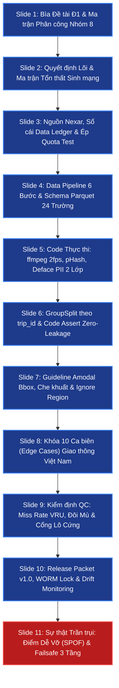
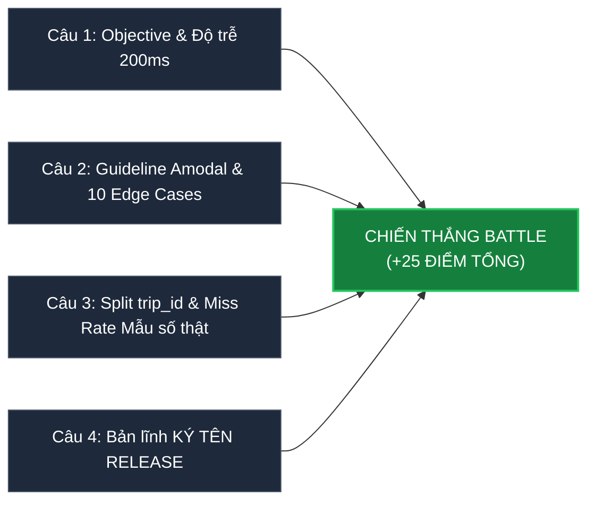

# BỘ CẨM NANG CHIẾN THUẬT BATTLE DATA WORKFLOW & CHUẨN KIỂM ĐỊNH RUBRIC 100 ĐIỂM
## CHUYÊN BIỆT ĐỀ TÀI Đ1: PHÁT HIỆN NGUY CƠ VA CHẠM CHO XE TỰ LÁI (VINFAST VF8/VF9 - ADAS / AEB)
**Chương trình:** Khóa học AICB-P2T4 · Bài 06: Quy trình Dữ liệu & Kiểm soát Chất lượng (VinUni & VinAI)  
**Tác giả:** Trưởng ban Đánh giá Chất lượng & Trợ giảng Cấp cao (Master QA Auditor)  
**Áp dụng:** Nhóm 8 · Lớp 2B-D304 (Phòng D304 · Chiều Thứ 6)  
**Mục tiêu tối thượng:** Đạt điểm tuyệt đối khung Rubric (65đ Giải pháp + 10đ Thuyết trình), chiến thắng Battle (+25đ), triệt tiêu 100% rủi ro từ 5 Cổng phạt chí mạng.

---

## MỤC LỤC CHIẾN LƯỢC
1. [Giải mã Hệ thống Chấm 100 điểm & Phòng tuyến 5 Cổng phạt](#1-giải-mã-hệ-thống-chấm-100-điểm--phòng-tuyến-5-cổng-phạt)
2. [Bộ Khung Tiêu chuẩn Slide Battle (11 Slides Chuẩn Đ1 VinFast)](#2-bộ-khung-tiêu-chuẩn-slide-battle-11-slides-chuẩn-đ1-vinfast)
3. [Slide Structure Checklist: Chi tiết 11 Slides & Nội dung Bắt buộc](#3-slide-structure-checklist-chi-tiết-11-slides--nội-dung-bắt-buộc)
4. [Bảng Ma trận Phân công Nhóm 8 (Member Matrix & RACI)](#4-bảng-ma-trận-phân-công-nhóm-8-member-matrix--raci)
5. [Hồ sơ Kỹ thuật Chuyên sâu Đề tài Đ1 (VinFast Collision Risk Detection)](#5-hồ-sơ-kỹ-thuật-chuyên-sâu-đề-tài-đ1-vinfast-collision-risk-detection)
6. [Kỹ thuật Đối chất 5 Phút: Bắn Hạ Đối Thủ & Phòng thủ Thép 45 Giây](#6-kỹ-thuật-đối-chất-5-phút-bắn-hạ-đối-thủ--phòng-thủ-thép-45-giây)
7. [Chiến thuật 4 Câu Bỏ phiếu: Thâu tóm Phiếu Cả lớp và 40% Trọng số Trợ giảng](#7-chiến-thuật-4-câu-bỏ-phiếu-thâu-tóm-phiếu-cả-lớp-và-40-trọng-số-trợ-giảng)
8. [Bộ 6 Câu Hỏi Trợ Giảng (TA Q1 - Q6) Độc quyền Cho Đ1 & Lời Giải Chuẩn](#8-bộ-6-câu-hỏi-trợ-giảng-ta-q1---q6-độc-quyền-cho-đ1--lời-giải-chuẩn)
9. [Checklist Bỏ túi Trước Giờ G (Pre-Flight Checklist 10 Điểm)](#9-checklist-bỏ-túi-trước-giờ-g-pre-flight-checklist-10-điểm)
10. [Vũ khí Nâng cao: Data Contract & Slice-based Evaluation Từ Bài 6](#10-vũ-khí-nâng-cao-data-contract--slice-based-evaluation-từ-bài-6)

---

## 1. GIẢI MÃ HỆ THỐNG CHẤM 100 ĐIỂM & PHÒNG TUYẾN 5 CỔNG PHẠT

### 1.1. Cấu trúc Điểm số Thực tế
Hệ thống thẩm định của Bài 06 không vận hành theo kiểu "làm đủ bài thì được điểm cao". Điểm số được chia thành 2 cấu phần tách biệt với triết lý thẩm định công nghiệp:

$$\text{Tổng điểm} = \underbrace{\text{Giải pháp + Slide (Tối đa 65đ)} + \text{Thuyết trình (Tối đa 10đ)}}_{\text{Khung Rubric: Tối đa 75 điểm (Chấm liên tục)}} + \underbrace{\text{Thắng Battle (+25đ)}}_{\text{Biểu quyết lớp + TA}}$$

* **Phần Giải pháp + Slide (65đ):** Đánh giá trên 6 trục: **Độ chi tiết · Edge cases · Tính logic xuyên suốt · Cân nhắc team size thực tế · Độ thực chiến (thừa nhận SPOF) · Độ hữu ích & Tái lập**. Slide đẹp nhưng rỗng tuếch sẽ bị trảm thẳng tay; slide trình bày logic kỹ thuật chặt chẽ, có bảng biểu định lượng, mã thực thi và hợp đồng dữ liệu rõ ràng sẽ ẵm trọn 65 điểm.
* **Phần Thuyết trình (10đ):** Đánh giá việc kiểm soát thời gian 10 phút, phân bổ mạch lạc, toàn bộ thành viên đều làm chủ thiết kế.
* **Thắng Battle (+25đ):** Quyết định bởi biểu quyết 4 câu hỏi đồng thời của cả lớp và Trợ giảng (TA nắm trọng số 40%).
* **Thang bậc phân loại:**
  * **90 – 100đ (Xuất sắc):** Quy trình chi tiết tới mức kỹ sư ADAS khác cầm về chạy được ngay; có ca khó đặc thù giao thông Việt Nam; chỉ rõ điểm dễ vỡ nhất (SPOF) và cơ chế khóa rủi ro 3 tầng. Đây là nhóm chiến thắng Battle.
  * **75 – 89đ (Tốt):** Thiết kế chắc tay, logic xuyên suốt, còn vài chỗ chung chung.
  * **60 – 74đ (Đạt):** Đủ 9 bước nhưng nặng lý thuyết giáo điều, thiếu case khó thực tế, không tính toán nhân lực.
  * **< 60đ (Cần làm lại):** Sơ sài, thủng logic rò rỉ dữ liệu, vi phạm cổng phạt.

---

### 1.2. Phòng tuyến Triệt tiêu 5 Cổng Phạt Chí Mạng (Fatal Penalty Gates)

| STT | Cổng Phạt (Fatal Gates) | Mức Phạt | Bản chất Lỗi & Bẫy Tâm lý | Hành động Khóa Rủi ro Tuyệt đối (Zero-Tolerance Policy) |
| :---: | :--- | :---: | :--- | :--- |
| **G1** | **Không nộp slide trước giờ battle** | **DISQUALIFIED** (Loại trực tiếp) | Sửa slide đến giây cuối cùng làm trễ deadline. | **Chốt nộp trước giờ G 15 phút.** Đúng phút thứ 105 của giờ làm việc, Nhóm trưởng khóa slide, xuất file, tải lên hệ thống/gửi TA. Không có ngoại lệ. |
| **G2** | **Slide không phải định dạng PDF** | **-5 ĐIỂM** | Dùng link Canva, Google Slides online dẫn đến lỗi mạng, nhảy font, không mở được trên máy chiếu D304. | **Chỉ xuất và nộp định dạng `PDF 16:9` chuẩn.** Đặt tên file đúng cú pháp: `Nhom08_Lop2B_D304_De1_VinFast.pdf`. Kiểm tra mở offline trên laptop dự phòng trước khi nộp. |
| **G3** | **Quá giờ thuyết trình 10 phút (bị cắt ngang)** | **-5 ĐIỂM** | Nói lan man ở phần mở đầu; dồn quá nhiều chữ khiến người nói đọc slide; không có đồng hồ căn giờ. | **Áp dụng quy tắc 8:30 Stop.** Thiết kế bài nói tối đa 8 phút 30 giây để dư 1 phút 30 giây đệm an toàn. Thành viên thuyết trình tập dượt với đồng hồ bấm giờ. Hết 8:30 chủ động kết thúc chuyển lượt. |
| **G4** | **Thiếu bảng phân công công việc từng thành viên** | **-10 ĐIỂM** | Để chung chung "cả nhóm cùng làm", vi phạm nguyên tắc truy cứu trách nhiệm công nghiệp. | **Đặt Bảng Ma trận Phân công (Member Matrix) ngay Slide 1.** Nêu rõ Họ tên, Email, Tổ công tác, Trách nhiệm Artifact bàn giao và Vùng phản biện của toàn bộ thành viên. |
| **G5** | **1 người gánh team, thành viên khác không trả lời được khi TA chỉ định** | **-10 ĐIỂM** | Nhóm cử 1 bạn giỏi nhất lên nói; các bạn còn lại ngồi im, khi TA gọi ngẫu nhiên thì ấp úng. | **Chiến thuật "Phân vùng Phòng thủ Cá nhân".** Mỗi thành viên phụ trách độc quyền 1 vùng chuyên môn và câu hỏi tủ TA (Mục 8). Khi TA gọi ai, người đó lập tức bật mic trả lời rành rọt trong 45 giây theo kịch bản chuẩn. |

---

### 1.3. Bản Đồ Chi Tiết 6 Tiêu Chí Barem 65 Điểm "Giải Pháp & Slide" Cho Đ1 VinFast

Căn cứ tài liệu thẩm định chính thức [`BattleDataWorkflow-grading.md`](https://github.com/hahahuy/K4-L2-DAY06-BattleDataWorkflow/blob/master/BattleDataWorkflow-grading.md), Nhóm 8 khóa chặt 6 tiêu chí cho bài toán va chạm:

```
                            TỔNG ĐIỂM BÀI BÁO CÁO (100 ĐIỂM)
  ┌─────────────────────────────────────────────────────────────┬─────────────────────┐
  │                   PHẦN RUBRIC (Tối đa 75 điểm)               │ THẮNG TRẬN (+25đ)   │
  ├─────────────────────────────────────────┬───────────────────┼─────────────────────┤
  │   I. GIẢI PHÁP & SLIDE (Tối đa 65đ)    │ II. THUYẾT TRÌNH  │ III. PHIẾU BẦU      │
  │   • Độ chi tiết kỹ thuật (15đ)          │     (Tối đa 10đ)  │      BATTLE (+25đ)  │
  │   • Xử lý Edge Cases va chạm (15đ)      │ • Đúng giờ < 10p  │ • Trọng số TA: 40%  │
  │   • Tính Logic xuyên suốt Cost (10đ)    │   (Quy tắc 8:30)  │ • Phiếu cả lớp: 60% │
  │   • Tính khả thi Team size (10đ)        │ • Mạch lạc, tự tin│ • Thắng: +25 điểm   │
  │   • Độ thực chiến & Thừa nhận SPOF (10đ)│ • 100% nhóm nắm   │ • Thua: +0 điểm     │
  │   • Độ hữu ích & Tái lập (5đ)           │   chắc chuyên môn │   (Giữ nguyên 75đ)  │
  └─────────────────────────────────────────┴───────────────────┴─────────────────────┘
```

| Tiêu chí Thẩm định | Thang điểm | Yêu cầu Bắt buộc Để Đạt Điểm Tối Đa (Áp cho Đ1 Crash) | Dấu hiệu Bị Giảm Điểm |
| :--- | :---: | :--- | :--- |
| **1. Độ chi tiết (Operational Depth)** | **15 điểm** | • Mỗi bước ghi rõ 4 thành tố: **Input Contract · Procedure · Artifact Output · Quality Gate**.<br>• Có bảng định lượng cụ thể: 2.844 video Nexar, tách frame 2fps, pHash Hamming $> 8$, deface 2 lớp PII, schema Parquet 24 trường, code thực thi có thể chạy ngay. | • Chỉ có tên bước, thiếu thông số kỹ thuật.<br>• Không có code hoặc lệnh CLI cụ thể.<br>• Gate định tính chung chung ("kiểm tra kỹ"). |
| **2. Xử lý Ca khó (Edge Case Rigor)** | **15 điểm** | • Nêu đích danh **10 ca khó giao thông Việt Nam**: Xe máy cut-in cự ly gần, đèn pha lóa trắng nửa khung, người dắt xe máy, bó người ngồi kẹp 3, giọt nước đọng kính lái.<br>• Định nghĩa bằng **dấu hiệu quan sát vật lý (Observable Attributes)**.<br>• Có quy tắc **Amodal Bbox** và **Ignore Region** (< 12px, glare bão hòa) rõ ràng. | • Bỏ qua các ca khó ban đêm, mưa ướt phản quang, góc khuất.<br>• Viết guideline dựa trên phỏng đoán ý định tài xế. |
| **3. Tính Logic Xuyên suốt (Architectural Consistency)** | **10 điểm** | • Toàn bộ thiết kế phụ thuộc vào **Objective 200ms & Asymmetric Cost Matrix**: Sót người đi bộ ($Cost=1000$) đắt gấp 6.67 lần phanh oan ($Cost=150$) và gấp 200 lần sót vật ngoài làn ($Cost=5$).<br>• Bác bỏ mAP trung bình, ép Cổng QC theo **Worst-Class Miss Rate $\le 0.1\%$ trên nhóm VRU**. | • Mâu thuẫn logic: Khẳng định tối ưu an toàn sinh mạng nhưng Bước 7 lại lấy Overall mAP hoặc Accuracy làm cổng nghiệm thu. |
| **4. Tính Khả thi theo Team Size (Capacity & Ops Planning)** | **10 điểm** | • Bản thiết kế chứng minh rõ đội ngũ vận hành nhịp nhàng: phân định **4 Tổ chuyên môn (A, B, C, D) / 8 vai trò RACI**.<br>• Tính toán cụ thể thông lượng: tách frame 2fps giảm 15 lần lưu trữ, AI pre-label tăng tốc 3-5 lần, giới hạn ca làm việc $\le 90$ phút để triệt tiêu mỏi mắt (Fatigue). | • Quy trình đòi hỏi đội ngũ 100 người phi thực tế.<br>• Thành viên gán nhãn tự duyệt bài của chính mình (Conflict of Interest). |
| **5. Độ Thực chiến & Thừa nhận SPOF (Production Readiness)** | **10 điểm** | • **"Thừa nhận điểm yếu được cộng điểm tối đa"**: Tự tin chỉ rõ nút thắt cổ chai dễ vỡ nhất là **Sự mỏi mệt của Reviewer tại Tổ D dẫn tới bẫy neo AI (Anchoring Bias)**.<br>• Xây dựng **Kiến trúc Phòng thủ Failsafe 3 Tầng**: CI/CD Schema Gate + 5% Honeypot Golden Frames + Khóa ca cứng 90 phút. | • Tự nhận quy trình hoàn hảo 100% không tì vết.<br>• Lúng túng, chối bỏ khi TA chỉ ra điểm gãy vật lý của cảm biến hoặc nhân sự. |
| **6. Độ Hữu ích & Khả năng Tái lập (Reproducibility)** | **5 điểm** | • Release Packet có đủ 5 cấu phần, mã băm SHA-256 niêm phong, khóa S3 Object Lock (WORM).<br>• **Dataset Card** công khai minh bạch ODD và Known Limitations (kính bẩn $> 30\%$, mưa tuyết dày đặc). | • Dữ liệu đóng gói tùy tiện, thiếu manifest split, người khác không thể tái lập thí nghiệm. |

---

## 2. BỘ KHUNG TIÊU CHUẨN SLIDE BATTLE (11 SLIDES CHUẨN Đ1 VINFAST)

Khung slide gồm đúng **11 slides** (đồng bộ tuyệt đối với [`slides_d1_vinfast.md`](file:///mnt/data/projects/vinai-in-action/DAY6/slides_d1_vinfast.md)), tối ưu hóa cho thời lượng trình bày **8 phút 30 giây** (trung bình 45 - 50 giây/slide), bao quát toàn bộ 9 bước Data Lifecycle của bài toán va chạm:



---

## 3. SLIDE STRUCTURE CHECKLIST: CHI TIẾT 11 SLIDES & NỘI DUNG BẮT BUỘC

### Slide 1: Bìa Đề tài Đ1 & Ma trận Phân công Nhóm 8 (Member Matrix)
* **Tiêu đề:** ĐỀ TÀI Đ1: PHÁT HIỆN NGUY CƠ VA CHẠM CHO XE TỰ LÁI (VINFAST)
* **Subtitle:** DATA PIPELINE CHỐNG RÒ RỈ & BẢO ĐẢM TÍNH MẠNG TRONG 200MS
* **Định danh:** Nhóm 8 · Lớp 2B-D304 · 100% Data Track (Không mô hình).
* **Nội dung bắt buộc (Triệt tiêu Cổng G4 & G5):**
  * Bảng phân công 4 Tổ (A, B, C, D) gắn với họ tên thành viên, trách nhiệm bàn giao cứng ở phút 40, và vùng câu hỏi TA phụ trách.
  * Tuyên ngôn: Không có điều phối viên ngồi không; mỗi thành viên là Lead Auditor của một phân vùng kỹ thuật.

### Slide 2: Quyết định Lõi & Ma trận Tổn thất Sinh mạng (Asymmetric Cost Matrix)
* **Câu quyết định chuẩn:** "Kích hoạt phanh khẩn cấp tự động (AEB) / Cảnh báo va chạm phía trước (FCW) / Không can thiệp, trên xe VinFast VF8/VF9, từ ảnh camera trước (FOV 120°), với độ trễ $\le 200\text{ ms}$."
* **Đơn vị dữ liệu:** 1 vật thể trong 1 khung hình camera trước.
* **Group key bắt buộc:** `trip_id` (một phiên ghi hình liên tục).
* **Bảng Ma trận Tổn thất Sinh mạng (Asymmetric Cost Matrix):**
  * Sót người đi bộ ($< 25\text{m}$, trong làn): Phạt 1000 (Đe dọa sinh mạng).
  * Sót xe máy ($< 25\text{m}$, trong làn): Phạt 800 (Giao thông VN dày đặc xe máy).
  * Sót ô tô trong làn gần: Phạt 200 (Thiệt hại tài sản).
  * Phanh oan (False Positive): Phạt 150 (Xe sau đâm dồn toa, rủi ro cao tại VN).
  * Cảnh báo oan (False Warning): Phạt 10 (Phiền nhiễu tài xế).
  * Sót vật ngoài làn / $> 25\text{m}$: Phạt 5.
* **3 Hệ quả lan tỏa:**
  1. Ép QC theo Worst-Class Recall trên nhóm VRU, cấm dùng mAP trung bình.
  2. Độ trễ 200ms ép giảm kích thước ảnh $\to$ Bắt buộc thiết lập Ignore Region cho vật thể quá nhỏ ($< 12\text{px}$).
  3. Chỉ Bbox là không đủ để phanh $\to$ Phải gán thuộc tính không gian (`lane_relation`) và động lực học (`motion_state`).

### Slide 3: Nguồn Dữ liệu Nexar, Sổ cái Data Ledger & Ép Quota Tập Test
* **Nguồn thực chiến chính:** **Nexar Collision Prediction** (2.844 video dashcam $1280 \times 720$ @ 30 FPS, Kaggle / Hugging Face).
  * Tập Train: 1.500 video full (~40s/video) gồm 750 positive (400 va chạm thật, 350 suýt va chạm) và 750 negative.
  * Tập Test: 1.344 video cắt ngắn tại các mốc `time_to_accident`: 0.5s, 1.0s, 1.5s.
* **Nguồn bổ trợ:** BDD100K (thuộc tính ngày/đêm), IDD (Ấn Độ - giao thông phi cấu trúc), EuroCity Persons, SODA10M (CC BY 4.0), Tự quay In-house (chuẩn hóa đường phố VN).
* **Sổ cái Dữ liệu (Data Ledger) & Quarantine Bucket:** Mọi clip hỏng codec, mất GPS/CAN bus đều bị chuyển vào thư mục cách ly `quarantine/`, tuyệt đối không xóa mù làm lệch mẫu số ban đầu.
* **Bảng Ép Quota Tập Test:**
  * Ban đêm / Thiếu sáng: $\ge 25\%$ số khung hình.
  * Mưa rào / Mặt đường ướt phản quang: $\ge 10\%$ số khung hình.
  * Ngược sáng / Bình minh / Ra khỏi hầm: $\ge 8\%$ số khung hình.
  * Người đi bộ băng đường ban đêm: $\ge 300$ instances.
  * Xe máy/ô tô tạt đầu đột ngột (Cut-in): $\ge 200$ sự kiện độc lập.

### Slide 4: Data Pipeline 6 Bước & Schema Parquet 24 Trường
* **Sơ đồ Pipeline:** Video thô (30fps) $\to$ 1. Tách Keyframe 2fps (giảm 15x, nhúng trip_id) $\to$ 2. Khử trùng pHash (lọc khung dừng đèn đỏ) $\to$ 3. Ẩn danh 2 lớp PII (deface + plate) $\to$ 4. AI Pre-label YOLOv10 (chỉ lấy conf > 0.6) $\to$ 5. Gán nhãn CVAT (sửa Bbox + nhãn động học) $\to$ 6. Xuất Manifest Parquet & COCO JSON.
* **Schema Flat Parquet (24 trường):**
  * Định danh: `trip_id`, `frame_id`, `timestamp_sec`, `img_path`, `img_w`, `img_h`.
  * Hình học: `obj_id`, `class_name`, `x_min`, `y_min`, `w`, `h`.
  * Che khuất: `occlusion_level` (0-25%, 25-50%, 50-80%, >80%), `truncated` (bool).
  * Động lực học phục vụ phanh: `lane_relation` (in_lane, near_lane, out_of_lane), `distance_band` (lt10m, 10to25m, gt25m), `motion_state` (static, along, crossing, cut_in).
  * Cờ kiểm soát: `ignore` (bool), `prelabel_modified` (bool).
  * Metadata & Kiểm toán: `lighting`, `weather`, `annotator_id`, `qc_status`, `anon_version`.

### Slide 5: Code Thực thi Cụ thể: ffmpeg, pHash & Cổng PII 2 Lớp
* **Lệnh 1 (Bash):** `ffmpeg -i raw_videos/trip_0042.mp4 -vf fps=2 -q:v 2 frames/trip_0042_%06d.jpg` (Tách 2fps, giữ chất lượng cao, nhúng trip_id vào filename).
* **Lệnh 2 (Python):** Khử trùng lặp pHash theo trip_id với context manager `with Image.open()` chống lỗi rò rỉ file handle; chỉ lưu frame nếu khoảng cách Hamming $> 8$ so với 30 frame gần nhất.
* **Lệnh 3 (Bash + Python):** Ẩn danh PII 2 lớp tuân thủ Nghị định 13/2023/NĐ-CP:
  * Lớp 1: Che khuôn mặt bằng `deface` (CenterFace, mở rộng biên 10%, Gaussian blur).
  * Lớp 2: Che biển số xe bằng `yolov8n-plate.pt` chuyên dụng, làm mờ vùng ROI bằng Gaussian Blur (51, 51).

### Slide 6: Chiến lược GroupSplit Chống Rò rỉ Dữ liệu & Code Assert Zero-Leakage
* **Tử huyệt Temporal Leakage:** Ở 30fps, 2 khung hình kề nhau cách 33ms chứa chung nền và người đi bộ. Chia ngẫu nhiên theo frame sẽ khiến mô hình học thuộc lòng, điểm mAP 94.2% ảo nhưng xe thật đâm vào tường.
* **3 Tầng Chống Rò rỉ:**
  1. Phân tách bằng `GroupShuffleSplit` theo `trip_id`: Train (70%), Val (15%), Test (15%).
  2. Báo cáo kiểm toán pHash xuyên tập: **0 cặp ảnh cận trùng (Hamming < 8)** giữa Train và Test.
  3. Bằng chứng thực nghiệm (Ablation): Chia ngẫu nhiên đạt mAP 94.2% ảo; chia theo `trip_id` đạt 81.5% thực tế $\to$ Khoảng chênh lệch $12.7\%$ chứng minh rò rỉ.
* **Đoạn code CI/CD Assert Zero-Leakage:**
  ```python
  assert set(df_train.trip_id).isdisjoint(set(df_val.trip_id)), "FATAL: Leak Train-Val!"
  assert set(df_train.trip_id).isdisjoint(set(df_test.trip_id)), "FATAL: Leak Train-Test!"
  assert set(df_val.trip_id).isdisjoint(set(df_test.trip_id)), "FATAL: Leak Val-Test!"
  ```

### Slide 7: Guideline Gán nhãn Amodal Bbox, Che khuất & Vùng Bỏ qua (Ignore Region)
* **Triết lý Hộp Amodal:** Phanh xe để tránh va chạm với *thể tích vật lý thực*, không phải với *pixel nhìn thấy*.
* **Quy tắc Che khuất:**
  * Che khuất $0 - 50\%$: Gán Bbox bình thường.
  * Che khuất $50 - 80\%$: Bắt buộc gán **Amodal Bbox** bao trùm toàn bộ thể tích suy đoán, gắn cờ `occlusion_level = 50-80%`.
  * Che khuất $> 80\%$: Đánh cờ `ignore = true` (giữ Bbox để tracking, không tính loss).
* **Xử lý Vùng Bỏ qua (Ignore Region):** Vật thể có chiều cao $< 12\text{px}$ (khoảng cách $> 80\text{m}$) hoặc nằm trọn trong vùng đèn pha lóa trắng bão hòa ($Pixel = 255$) $\implies$ Đánh cờ `ignore = true`. Vùng này **không tính True Positive và không phạt False Positive**.
* **Quyền Abstain:** Bằng chứng hình học mờ mịt (sương mù dày) $\to$ Bấm Abstain gắn tag `can_xem_lai` để chuyển hội chẩn dữ liệu Radar 77GHz, cấm đoán mò.

### Slide 8: Khóa 10 Ca biên (Edge Cases) Thực chiến Giao thông Việt Nam
* **10 Ca biên & Quy tắc Quyết định Vật lý:**
  1. *Người khuất sau cột điện (chỉ lộ 1 chân):* Gán Amodal Bbox trùm chiều cao cơ thể suy đoán, cờ `occlusion_level = 50-80%`.
  2. *Xe máy khuất sau đuôi ô tô (chỉ thò gương):* Thấy gương + tay lái $\to$ Gán Amodal Bbox xe máy. Chỉ thấy gương đơn độc $\to$ Cờ `ignore = true`.
  3. *Người dắt xe máy:* Gộp thành **1 Bbox duy nhất**, gán class `Pedestrian` (nếu sát vỉa hè) hoặc `UNKNOWN_OBJECT` (nếu dắt ngang giữa làn).
  4. *Người ngồi trên xe máy (kẹp 2, kẹp 3):* Cấm tách lớp `rider`, gán **1 Bbox duy nhất** bao trọn người lái, người ngồi sau và thân xe (Kinematic Footprint).
  5. *Đèn pha xe tải ngược chiều lóa trắng nửa khung:* Khoanh vùng lóa, gán nhãn `ignore = true`.
  6. *Giọt nước đọng kính lái (Ghosting):* Kiểm tra liên tiếp 3 frame; nếu không chuyển động tịnh tiến theo mặt đường $\to$ Cấm gán (Artifact quang học).
  7. *Đám đông 3 người chồng lấp:* Nhìn thấy $\ge 20\%$ cơ thể mỗi người $\to$ Gán Bbox riêng. Dính chặt thành khối $\to$ Gán 1 Bbox lớn bao quanh kèm cờ `ignore = true`.
  8. *Xe máy tạt đầu (Cut-in) mới lộ 1/3 thân xe:* Bắt buộc gán Amodal Bbox, đánh cờ `motion_state = cut_in` và `lane_relation = in_lane`.
  9. *Bóng phản chiếu trên mặt đường ướt / kính:* Cấm gán nhãn, chỉ gán trên thực thể vật lý có bóng đổ.
  10. *Hình vẽ/pano quảng cáo người/xe trên thân xe buýt:* Cấm gán nhãn, đối chiếu mặt phẳng chuyển động cùng vận tốc xe buýt.

### Slide 9: Kiểm định QC: Metric Miss Rate VRU, Gán Đôi Mù & Cổng Lô Cứng
* **Bác bỏ mAP Tổng hợp:** mAP che giấu các lát cắt tử huyệt (sót 1 người đi bộ ban đêm bị hòa tan trong 10.000 xe ô tô ban ngày).
* **Chỉ số Sống còn:** **Miss Rate trên nhóm VRU nguy hiểm** (`Pedestrian` + `Motorcycle`, cự ly $< 25\text{m}$, trong làn) tại điểm hoạt động cố định $\le 0.1\text{ False Positive / khung hình}$:
  $$\text{Miss Rate}_{\text{VRU}} = \frac{\text{FN}_{\text{VRU}}}{\text{TP}_{\text{VRU}} + \text{FN}_{\text{VRU}}} \times 100\% \quad (\text{Mẫu số: Tổng số VRU thực tế có mặt})$$
* **Quy trình Kiểm định 2 Tầng:**
  * Tập Train: Gán đơn, audit ngẫu nhiên 20% (rút 100 khung / lô 500 khung).
  * Tập Val/Test: **Gán Đôi Mù 100% (Independent Double-blind)** giữa 2 annotator độc lập $\to$ Adjudicator phân xử tạo tập Gold Ground Truth.
* **Chèn Bẫy Ngầm (Honeypot 5%):** Trộn ngầm 5% khung ảnh đã có đáp án chuẩn của Chuyên gia vào mỗi lô để giám sát annotator.
* **Cổng Nghiệm thu Lô Cứng (Zero-Tolerance Gate):**
  * Người đi bộ trong làn $< 25\text{m}$: **Recall bắt buộc 100% (Sót dù chỉ 1 người $\to$ REJECT TOÀN BỘ LÔ 500 KHUNG HÌNH)**.
  * Xe máy trong làn $< 25\text{m}$: Recall $\ge 99\%$, IoU $\ge 0.70$, thuộc tính đúng $\ge 95\%$.
  * Ô tô: Recall $\ge 95\%$, IoU $\ge 0.60$.

### Slide 10: Release Packet v1.0, WORM Lock, Drift Monitoring & Vòng Lặp Telemetry
* **Bộ 5 Thành phần Bắt buộc của Release Packet v1.0:**
  1. Dữ liệu sạch + Nhãn Parquet/COCO đóng băng cấp mã băm **SHA-256 Checksum**, bật **S3 Object Lock (WORM - Write Once, Read Many)** chống sửa đổi nhãn sau xuất xưởng.
  2. Data Split Manifest: File `split_manifest.json` chứng minh giao thoa theo `trip_id` bằng chính xác $0.00\%$.
  3. Báo cáo Kiểm toán QC (Audit Report): Báo cáo nghiệm thu mẫu audit 20%, xác nhận tỷ lệ sót PII $\le 0.001\%$.
  4. Test Suite Xác thực: Script CI/CD tự động kiểm tra: 0 tọa độ NaN, 0 box tràn viền, 0 box diện tích $\le 0$.
  5. Dataset Card Tiêu chuẩn: Công bố ODD và **Known Limitations (Giới hạn đã biết)**: Chưa hỗ trợ khi kính lái bám bùn $> 30\%$ hoặc mưa tuyết dày đặc.
* **Giám sát Drift Sau Triển Khai:** Tính khoảng cách Wasserstein / PSI trên histogram độ rọi Lux và tán xạ hạt mưa. Nếu PSI $> 0.2 \to$ Báo động Data Drift, kích hoạt thu thập bổ sung.
* **Vòng lặp Phản hồi Telemetry Từ Đội Xe:**
  * Tài xế đạp thốc ga đè phanh $\implies$ **Phanh oan (FP)** $\to$ Hộp đen tự động lưu 15 giây video.
  * Tài xế phanh gấp $> 0.6\text{g}$ hoặc đánh lái né $\implies$ **Bỏ sót vật cản (FN)** $\to$ Hộp đen trích xuất clip gửi về S3.
* **Giao thức Sửa lỗi Tận gốc (Root Cause Rework):** Cấm sửa lẻ tẻ vài ảnh. Họp Adjudication $\to$ Cập nhật Guideline v1.2 $\to$ Hồi tố (Retroactive Audit) quét lại toàn bộ dữ liệu cũ để gán bổ sung.

### Slide 11: Sự Thật Trần Trụi: Điểm Dễ Vỡ (SPOF) & Kiến Trúc Phòng Thủ 3 Tầng
* **Thừa nhận Điểm Gãy Duy Nhất (Single Point of Failure - SPOF):** 
  * "Với đội hình làm việc dưới áp lực thời gian, điểm dễ vỡ nhất không nằm ở code hay thuật toán, mà nằm ở **SỰ MỆT MỎI CỦA CON NGƯỜI TẠI KHÂU REVIEW QC CỦA TỔ D**."
  * Sau 90 phút nhìn màn hình, mắt bị mỏi và xuất hiện **Hiệu ứng Neo (Anchoring Bias)**: Người duyệt tin tưởng vào nhãn AI Prelabel, lướt nhanh và bấm Approve hàng loạt, làm lọt lưới người đi bộ ban đêm vào tập test.
* **Kiến trúc Phòng thủ 3 Tầng Chặn Đứng Sự Sụp Đổ:**
  1. *Tầng 1 - CI/CD Automated Gate (Tổ B):* Script Python tự động reject ngay lập tức nếu file Parquet có box thiếu trường `motion_state`, tọa độ âm, hoặc diện tích $< 144\text{px}^2$ mà không cắm cờ `ignore`.
  2. *Tầng 2 - Bẫy Ngầm Kỹ thuật số (Honeypot 5% - Tổ D):* Trộn ngầm 5% khung ảnh Vàng chuẩn. Nếu Reviewer lướt qua frame $< 3.0\text{s}$ hoặc để lọt 1 lỗi sót người đi bộ trên ảnh vàng $\implies$ Khóa tài khoản, tước quyền nghiệm thu và tái kiểm định toàn bộ lô.
  3. *Tầng 3 - Kỷ luật Bào mòn (Fatigue Rule):* Khóa mềm giao diện CVAT sau đúng **90 phút làm việc liên tục**, ép buộc nghỉ ngơi 15 phút để phục hồi thị giác.
* **Tuyên bố Ký Release:** Data Owner cam kết ký tên phát hành bộ dữ liệu vì mọi rủi ro sinh mạng đều đã được khóa cứng bằng toán học và quy trình kiểm toán độc lập.

---

## 4. BẢNG MA TRẬN PHÂN CÔNG NHÓM 8 (MEMBER MATRIX & RACI)

Bảng phân công thiết lập theo mô hình **Phân quyền Quản trị Dữ liệu Cấp Công nghiệp**, phân bổ 6 thành viên thực tế của Nhóm 8 vào 4 Tổ công tác (A, B, C, D) đảm nhận 8 vai trò kỹ thuật, đảm bảo không có xung đột lợi ích:

| Tổ | Thành viên | Email VinUni | Vai trò Lifecycle Cụ thể | Trách nhiệm Bàn giao Cứng (Hạn Phút 40) | Vùng Chuyên môn Phản biện 6 Câu hỏi TA (Bất kỳ ai cũng có thể bị gọi) |
| :---: | :--- | :--- | :--- | :--- | :--- |
| **A (NGUỒN)** | **Thành viên 1** | `member1@vinuni.edu.vn` | **Data Sourcing & License Lead** | Khai thác Nexar, Sổ nguồn Data Ledger, License, phân tích ODD. | **[TA Q1 - Lead]** Dataset phục vụ quyết định nào, ai là người dùng cuối?<br>• Phối hợp giải trình nguồn Car/Truck vs VRU. |
| **A (NGUỒN)** | **Thành viên 2** | `member2@vinuni.edu.vn` | **Quota & Sampling Lead** | Lập Bảng Quota Test (Đêm/Mưa/Cut-in), thống kê phân bố tự nhiên Nexar. | Hỗ trợ TA Q1 & Giải trình hạn ngạch tập test (đêm ≥ 25%). |
| **B (XỬ LÝ)** | **Thành viên 3** | `member3@vinuni.edu.vn` | **Pipeline Ops & PII Compliance** | Script ffmpeg tách 2fps, Cổng chặn PII 2 lớp (deface + plate), Quarantine bucket. | **[TA Q6 - Đồng phụ trách]** Failsafe CI/CD & Pipeline execution. |
| **B (XỬ LÝ)** | **Thành viên 4** | `member4@vinuni.edu.vn` | **Schema & Deduplication Lead** | Khử trùng pHash, Schema Parquet 24 trường, CVAT Track Mode setup. | **[TA Q4 - Lead]** Kỹ thuật lọc trùng pHash, Schema Parquet 24 trường. |
| **C (NHÃN)** | **Thành viên 5** | `member5@vinuni.edu.vn` | **Lead Guideline Architect** | Soạn thảo Guideline Amodal Bbox, Ignore Region, Pilot 30 ảnh, bộ 10 ca biên. | **[TA Q3 - Lead]** Xử lý ca khó: Xe máy cut-in, đèn lóa trắng, quyền Abstain.<br>• Giải trình Decision Log và rule v1.1. |
| **C (NHÃN)** | **Thành viên 6** | `member6@vinuni.edu.vn` | **Edge Cases & Dynamic State Lead**| Xây dựng kịch bản 10 ca biên, nhãn động học (lane/motion/risk_status). | Hỗ trợ TA Q3 & Giải trình Decision Log. |
| **D (ĐO LƯỜNG)**| **Thành viên 7** *(Lead)* | `member7@vinuni.edu.vn` | **Data Owner & Lead Release Auditor**| Chốt Data Objective 200ms, Ma trận tổn thất Cost Matrix, GroupSplit trip_id. | **[TA Q2 - Lead]** Mục tiêu, Asymmetric Cost (FN 1000 vs FP 150).<br>• Ký lệnh Release hoặc lệnh HOLD đóng băng lô. |
| **D (ĐO LƯỜNG)**| **Thành viên 8** | `member8@vinuni.edu.vn` | **Lead QA/QC Auditor & Metric Controller**| Đo Miss Rate VRU @ 0.1FP, Gán Đôi Mù Test set, Phân tích SPOF Failsafe 3 tầng.| **[TA Q5 - Lead] & [TA Q6 - Lead]** Chỉ số đo chất lượng, SPOF khâu Review. |

---

## 5. HỒ SƠ KỸ THUẬT CHUYÊN SÂU ĐỀ TÀI Đ1 (VINFAST COLLISION RISK DETECTION)

### 5.1. Bối cảnh Nghiệp vụ, Đơn vị Dữ liệu & Ràng buộc 200ms
* **Bối cảnh vận hành:** Xe điện thông minh VinFast (VF8, VF9) trang bị camera trước góc rộng FOV 120°, độ phân giải Full HD gắn sau gương chiếu hậu, kết nối trực tiếp với bộ xử lý nhận thức ADAS.
* **Đơn vị dữ liệu (Unit of Data):** **1 vật thể trong 1 khung hình camera trước**.
* **Ràng buộc thời gian thực ($< 200\text{ ms}$):**
  * Tốc độ xe $80\text{ km/h} \approx 22.2\text{ m/s}$. Mỗi 100ms trễ tương đương xe trôi thêm $2.22\text{ m}$ không kiểm soát.
  * Toàn bộ chuỗi nhận thức: Đọc cảm biến ($33\text{ms}$) $\to$ Tiền xử lý & Inference ($70\text{ms}$) $\to$ Tracking & Temporal Fusion ($30\text{ms}$) $\to$ Bộ điều khiển phanh CAN bus ($50\text{ms}$) = **Tổng $183\text{ ms} < 200\text{ ms}$**.
* **Ràng buộc quang học & Vùng Bỏ qua (Ignore Region):** Để đạt thời gian trễ $< 200\text{ms}$, mô hình phải giảm độ phân giải đầu vào ($640 \times 640$ hoặc $960 \times 540$). Một người đi bộ ở khoảng cách $> 80\text{m}$ chỉ chiếm chiều cao $< 12\text{px}$, không đủ thông tin quang học để nhận dạng $\implies$ Bắt buộc thiết lập Ignore Region (`ignore = true`), không tính loss để tránh gây nhiễu gradient huấn luyện.

---

### 5.2. Ma trận Tổn thất Sinh mạng (Asymmetric Cost Matrix) & Tác động Lan tỏa

$$\text{Total Risk Cost} = 1000 \cdot \text{FN}_{\text{Pedestrian}} + 800 \cdot \text{FN}_{\text{Motorcycle}} + 200 \cdot \text{FN}_{\text{Car}} + 150 \cdot \text{FP}_{\text{PhantomBrake}} + 10 \cdot \text{FP}_{\text{Warning}} + 5 \cdot \text{FN}_{\text{OutLane}}$$

```
                                  MA TRẬN ĐÁNH ĐỔI ASYMMETRIC COST
  ┌────────────────────────────────────────────────────────┬──────────────────────────────────────────┐
  │         FALSE NEGATIVE (BỎ SÓT VẬT CẢN)                │        FALSE POSITIVE (PHANH OAN)        │
  ├────────────────────────────────────────────────────────┼──────────────────────────────────────────┤
  │ • Sót người đi bộ trong làn (<25m): Phạt 1000 (TỬ VONG)│ • Phanh ma giữa cao tốc: Phạt 150        │
  │ • Sót xe máy trong làn (<25m): Phạt 800 (NGUY HIỂM CAO)│   (Xe sau đâm dồn toa, lật xe)           │
  │ • Sót ô tô trong làn gần: Phạt 200 (THIỆT HẠI TÀI SẢN) │ • Cảnh báo oan liên tục: Phạt 10         │
  │ • Sót vật thể ngoài làn / >25m: Phạt 5                 │   (Tài xế ức chế, tắt hệ thống ADAS)     │
  ├────────────────────────────────────────────────────────┴──────────────────────────────────────────┤
  │ ⇒ HỆ QUẢ KỸ THUẬT LAN TỎA 100%:                                                                   │
  │   1. Đánh đổi: Bỏ sót đắt gấp 6.67 lần phanh oan ⇒ Chấp nhận tăng FP ở tầng detector thô để triệt │
  │      tiêu hoàn toàn FN trên nhóm VRU; khử FP bằng Temporal Smoothing (3 frame liên tiếp).          │
  │   2. Bác bỏ mAP trung bình ⇒ Ép cổng QC bằng Worst-Class Recall ≥ 99.5% trên nhóm người đi bộ.    │
  │   3. Chuyển đổi toàn bộ quy tắc gán nhãn sang hộp Amodal Bbox (ôm trọn thể tích vật lý thực).     │
  └───────────────────────────────────────────────────────────────────────────────────────────────────┘
```

---

### 5.3. Nguồn Dữ liệu, Phân tích Pháp lý & Quota Ép Tập Test

* **Bộ dữ liệu thực chiến chính:** **Nexar Collision Prediction Dataset**
  * *Nguồn gốc:* Thu thập từ hàng triệu dashcam hành trình xe thật, lưu trữ chính thức trên Kaggle (`nexar-collision-prediction`) và Hugging Face Mirror (`nexar-ai/nexar_collision_prediction`).
  * *Quy mô:* 2.844 video clip MP4 ($1280 \times 720$ @ 30 FPS). Tập Train 1.500 video (750 positive có va chạm hoặc suýt va chạm near-miss; 750 negative). Tập Test 1.344 video cắt ở các mốc thời gian phản ứng sống còn (`time_to_accident`: 0.5s, 1.0s, 1.5s).
* **Bộ dữ liệu bổ trợ:**
  * BDD100K: Khai thác nhãn điều kiện ánh sáng (đêm, chạng vạng) và thời tiết (mưa, sương mù).
  * IDD (India Driving Dataset): Bổ sung hành vi giao thông hỗn tạp của xe máy tương đồng với Việt Nam (CC BY-NC 4.0).
  * EuroCity Persons: Chuẩn hóa benchmark phát hiện người đi bộ ban đêm.
  * SODA10M: Nguồn ảnh giao thông đường phố lớn chuẩn châu Á, giấy phép thương mại an toàn (CC BY 4.0).
  * Tự thu thập (In-house): 8 giờ video ghi hình thực tế bằng xe VinFast trên đường phố Hà Nội (Proprietary).
* **Bảng Hạn Ngạch Ép Cứng Trên Tập Test (Quota Allocation):**
  * Ban đêm / Thiếu sáng: $\ge 25\%$ tổng số khung hình ($n \ge 2.500$ frames).
  * Mưa rào / Mặt đường ướt phản quang đèn đường: $\ge 10\%$ tổng số khung hình.
  * Ngược sáng lóa đèn pha / Ra khỏi hầm: $\ge 8\%$ tổng số khung hình.
  * Người đi bộ băng qua đường ban đêm: $\ge 300$ instances độc lập.
  * Xe máy tạt đầu cự ly gần (Cut-in $< 15\text{m}$): $\ge 200$ sự kiện độc lập.

---

### 5.4. Pipeline Xử lý Dữ liệu & Mã Lệnh Thực Thi (Runnable Scripts)

#### Lệnh 1: Tách Keyframe 2 fps & Nhúng cứng `trip_id` (Bash)
```bash
# Tạo thư mục đích
mkdir -p frames/
# Tách khung 2fps (giảm 15 lần lưu trữ), giữ chất lượng ảnh q:v 2, nhúng trip_id vào filename
ffmpeg -i raw_videos/trip_0042.mp4 -vf fps=2 -q:v 2 frames/trip_0042_%06d.jpg
```

#### Lệnh 2: Khử Trùng lặp bằng pHash Có Kiểm soát Tài nguyên (Python)
```python
import imagehash, glob, os, shutil
from PIL import Image

output_dir = "filtered_frames"
os.makedirs(output_dir, exist_ok=True)

# Lọc theo từng trip để tránh so sánh nhầm lẫn xuyên hành trình
trips = set(os.path.basename(p).split('_')[0] + '_' + os.path.basename(p).split('_')[1] 
            for p in glob.glob("frames/*.jpg"))

for trip in sorted(trips):
    trip_frames = sorted(glob.glob(f"frames/{trip}_*.jpg"))
    seen_hashes = []
    for p in trip_frames:
        # Context manager 'with' tự động đóng file handle, triệt tiêu lỗi 'Too many open files'
        with Image.open(p) as img:
            h = imagehash.phash(img)
        # Chỉ giữ frame nếu khác biệt Hamming > 8 so với 30 frame gần nhất (loại bỏ dừng đèn đỏ)
        if all(h - s > 8 for s in seen_hashes[-30:]):
            seen_hashes.append(h)
            shutil.copy(p, os.path.join(output_dir, os.path.basename(p)))
```

#### Lệnh 3: Ẩn danh PII 2 Lớp (Khuôn mặt + Biển số xe) (Bash / Python)
```bash
# Lớp 1: Che mờ khuôn mặt bằng deface (dùng CenterFace, mở rộng biên 10%)
deface filtered_frames/ --thresh 0.2 --replacewith blur --boxes

# Lớp 2: Che mờ biển số xe bằng YOLOv8-plate chuyên dụng (Gaussian Blur 51x51)
python -c "
from ultralytics import YOLO
import cv2, glob

model = YOLO('yolov8n-plate.pt')
for p in glob.glob('filtered_frames/*.jpg'):
    img = cv2.imread(p)
    results = model(img, verbose=False)
    for box in results[0].boxes.xyxy.cpu().numpy():
        x1, y1, x2, y2 = map(int, box)
        h, w = y2 - y1, x2 - x1
        x1, y1 = max(0, x1 - int(0.1*w)), max(0, y1 - int(0.1*h))
        x2, y2 = min(img.shape[1], x2 + int(0.1*w)), min(img.shape[0], y2 + int(0.1*h))
        roi = img[y1:y2, x1:x2]
        img[y1:y2, x1:x2] = cv2.GaussianBlur(roi, (51, 51), 15)
    cv2.imwrite(p, img)
"
```

#### Lệnh 4: Phân tách Chống Rò rỉ Train / Val / Test theo `trip_id` (Python)
```python
import pandas as pd
from sklearn.model_selection import GroupShuffleSplit

df = pd.read_parquet("manifest.parquet")

# Tách tập Test (15% số chuyến)
gss_test = GroupShuffleSplit(n_splits=1, test_size=0.15, random_state=42)
train_val_idx, test_idx = next(gss_test.split(df, groups=df.trip_id))
df_train_val = df.iloc[train_val_idx]
df_test = df.iloc[test_idx]

# Tách tập Train (70%) và Val (15%) từ phần còn lại
gss_val = GroupShuffleSplit(n_splits=1, test_size=0.1765, random_state=42)
train_idx, val_idx = next(gss_val.split(df_train_val, groups=df_train_val.trip_id))
df_train = df_train_val.iloc[train_idx]
df_val = df_train_val.iloc[val_idx]

# BẰNG CHỨNG KIỂM TOÁN TỰ ĐỘNG TRÊN CI/CD
train_trips = set(df_train.trip_id)
val_trips = set(df_val.trip_id)
test_trips = set(df_test.trip_id)

assert train_trips.isdisjoint(val_trips), "FATAL: Rò rỉ Train-Val!"
assert train_trips.isdisjoint(test_trips), "FATAL: Rò rỉ Train-Test!"
assert val_trips.isdisjoint(test_trips), "FATAL: Rò rỉ Val-Test!"
print(f"Zero-Leakage Hoàn hảo: Train={len(train_trips)}, Val={len(val_trips)}, Test={len(test_trips)} trips.")
```

---

### 5.5. Schema Manifest Định Dạng Parquet Đầy Đủ (24 Trường)

Lưu trữ dạng Flat Table trên định dạng Apache Parquet hỗ trợ truy vấn siêu tốc:

```yaml
Schema Manifest (manifest.parquet - 1 dòng = 1 vật thể trong 1 khung):
  # 1. Định danh & Ảnh gốc (Image-level):
  - trip_id: string          # Mã hành trình (Group Key bất biến)
  - frame_id: string         # Mã khung hình (trip_0042_000120)
  - timestamp_sec: float     # Thời điểm trong chuyến (giây)
  - img_path: string         # Đường dẫn file ảnh tương đối
  - img_w: int               # Chiều rộng ảnh (1280)
  - img_h: int               # Chiều cao ảnh (720)
  
  # 2. Tọa độ Hình học Bounding Box:
  - obj_id: int              # ID định danh theo dõi vật thể (Tracking ID)
  - class_name: string       # [Pedestrian, Bicycle, Motorcycle, Car, Bus_Truck, UNKNOWN_OBJECT]
  - x_min: float             # Tọa độ pixel góc trên bên trái
  - y_min: float
  - w: float                 # Chiều rộng và chiều cao hộp
  - h: float

  # 3. Thuộc tính Che khuất & Cắt biên:
  - occlusion_level: string  # [0-25%, 25-50%, 50-80%, >80%]
  - truncated: bool          # Bị cắt ở mép ảnh camera (diện tích nhìn thấy >= 25%)

  # 4. Ba trường Động học Sống còn phục vụ Phanh AEB:
  - lane_relation: string    # [in_lane, near_lane, out_of_lane]
  - distance_band: string    # [lt10m, 10to25m, gt25m]
  - motion_state: string     # [static, along, crossing, cut_in]

  # 5. Cờ Bỏ qua & Kiểm soát Pre-label:
  - ignore: bool             # Zero-loss flag (Bbox < 12px, lóa bão hòa pixel=255)
  - prelabel_modified: bool  # True nếu annotator có can thiệp sửa đổi nhãn AI

  # 6. Metadata Môi trường & Kiểm toán Nguồn gốc (Provenance):
  - lighting: string         # [daylight, twilight, night_lit, night_dark, glare]
  - weather: string          # [clear, cloudy, rain, fog]
  - annotator_id: string     # Mã định danh nhân sự gán nhãn
  - qc_status: string        # [pending, approved, rejected, escalated]
  - anon_version: string     # Phiên bản PII blur (deface_v1.2)
```

---

## 6. KỸ THUẬT ĐỐI CHẤT 5 PHÚT: BẮN HẠ ĐỐI THỦ & PHÒNG THỦ THÉP 45 GIÂY

### 6.1. Bắn 2 Phát Súng Hạ Gục Đối Thủ (Offensive Strategy)
Tùy vào nhóm đối thủ trong trận Battle, người chất vấn của Nhóm 8 đứng dậy, nói to, dõng dạc, bắn thẳng vào 2 tử huyệt mà 90% các nhóm sinh viên đều mắc phải:

#### CÂU HỎI 1: Bẫy Điểm Test Ảo do Data Leakage (Bắn thẳng vào Bước 3 & 6)
> *"Xin hỏi nhóm bạn: Các bạn chia train/validation/test dựa trên tiêu chí nào? Nếu các bạn chia ngẫu nhiên theo khung hình (random frame split) mà không gom nhóm theo `trip_id`, các bạn có nhận thức được rằng camera 30fps có 2 khung kề nhau cách nhau chỉ 33ms giống hệt nhau? Điểm test 95% của các bạn hoàn toàn là 'điểm số dối trá' do mô hình học thuộc lòng bối cảnh. Nhóm bạn có bằng chứng kiểm toán rò rỉ nào bằng code chứng minh giao thoa tập hợp bằng 0% không?"*

#### CÂU HỎI 2: Bẫy Số Liệu Đẹp Ảo & Mẫu Số Ma trong QC (Bắn thẳng vào Bước 7)
> *"Khi nhóm bạn công bố độ chính xác 98% ở khâu QC, xin cho biết mẫu số của tỷ lệ này là gì? Các bạn đo trên Random Audit hay Risk Queue? Và quan trọng nhất: Với lớp nguy hiểm nhất là Người đi bộ ban đêm và Xe máy tạt đầu trong làn, Miss Rate cụ thể là bao nhiêu? Nếu mô hình của các bạn bỏ sót 1% người đi bộ trong vận hành thực tế dẫn tới tai nạn chết người, ai trong nhóm bạn sẽ ký tên chịu trách nhiệm pháp lý?"*

---

### 6.2. Kịch bản Phòng thủ Thép 45 Giây (Defensive Protocol: 15s – 20s – 10s)

```
[00s - 15s] TRỰC DIỆN & KHẲNG ĐỊNH ASYMMETRIC COST
"Cảm ơn câu hỏi của nhóm bạn. Đây không phải lỗi, đây là sự đánh đổi Asymmetric Cost có chủ đích được chốt chặt từ Bước 1. Chúng tôi chấp nhận nới lỏng False Positive ở tầng trinh sát thô để triệt tiêu 100% False Negative trên nhóm người đi bộ, vì cái giá của FN là tính mạng con người."

[15s - 35s] ĐƯA BẰNG CHỨNG SỐ LIỆU, CODE & GROUP KEY
"Để chống rò rỉ, chúng tôi dùng Group Key bắt buộc là `trip_id` với GroupShuffleSplit ở Slide 6, chứng minh bằng lệnh assert giao thoa bằng đúng 0.00%. Ở khâu QC Slide 9, chúng tôi bác bỏ mAP trung bình, đo bằng Miss Rate trên nhóm VRU ở cự ly < 25m với mẫu số tường minh, và áp dụng cổng Cấm Sót: Sót 1 người đi bộ trong làn là REJECT toàn bộ lô 500 khung hình."

[35s - 45s] TỐI HẬU THƯ SẢN XUẤT & CAM KẾT KÝ RELEASE
"Nếu vi phạm ngưỡng này, Data Owner (Thành viên 7) sẽ lập tức ký lệnh HOLD đóng băng lô hàng. Chúng tôi thà chậm tiến độ chứ tuyệt đối không bao giờ ký release một bộ dữ liệu có nguy cơ gây tai nạn cho xe VinFast!"
```

---

## 7. CHIẾN THUẬT 4 CÂU BỎ PHIẾU: THÂU TÓM PHIẾU CẢ LỚP VÀ 40% TRỌNG SỐ TRỢ GIẢNG

Cả lớp và TA sẽ giơ phiếu biểu quyết đồng thời cho 4 câu hỏi cốt lõi để quyết định nhóm nhận **+25 điểm Thắng Battle**:



### 4 Đòn Tâm Lý Lôi Kéo Phiếu Bầu Của Nhóm 8:
1. **Câu 1: Nhóm nào có Data Objective và Scope rõ ràng, gắn chặt với quyết định thực tế hơn?**  
   * *Đòn tâm lý:* "Đối thủ chỉ nói chung chung 'để nhận diện xe/người'. Nhóm 8 khẳng định rõ: Phục vụ quyết định kích hoạt phanh khẩn cấp AEB trong thời gian trễ dưới 200ms trên xe VinFast VF8/VF9."
2. **Câu 2: Nhóm nào có Annotation Guideline chi tiết, giải quyết các ca khó thuyết phục hơn?**  
   * *Đòn tâm lý:* Chiếu Slide 8 với 10 ca biên cụ thể bằng dấu hiệu quan sát vật lý. "Guideline của Nhóm 8 không bắt annotator đoán mò ý định tài xế, mà định nghĩa bằng kích thước hình học và quy tắc Amodal Bbox rõ ràng."
3. **Câu 3: Nhóm nào có chiến lược Split chống rò rỉ và phương pháp đo QC trung thực?**  
   * *Đòn tâm lý:* "Nhóm 8 công khai chênh lệch $12.7\%$ giữa chia ngẫu nhiên và chia theo `trip_id` để chứng minh sự trung thực. Chúng tôi bác bỏ mAP làm đẹp số liệu, đối diện trực tiếp với Worst-Class Miss Rate."
4. **Câu 4 (Câu Quyết Định): Bạn DÁM KÝ TÊN RELEASE bộ dữ liệu của nhóm nào?**  
   * *Đòn tâm lý (Lời kết thuyết trình):*  
     > *"Thưa các bạn và Hội đồng: Một bản thiết kế hoàn hảo trên giấy không cứu được người đi bộ khi xe tự lái lao trên đường ban đêm. Nhóm 8 mang đến một quy trình có trách nhiệm pháp lý, có cổng chặn Zero-Tolerance, và dám chỉ rõ điểm yếu mỏi mệt của nhân sự để khóa bằng Failsafe 3 tầng. Hãy hỏi chính mình: Bạn có dám ngồi trên một chiếc xe VinFast chạy bằng bộ dữ liệu chia ngẫu nhiên của đối thủ không? Hay bạn sẽ chọn sự an toàn tuyệt đối từ bản thiết kế của Nhóm 8?"*

---

## 8. BỘ 6 CÂU HỎI TRỢ GIẢNG (TA Q1 - Q6) ĐỘC QUYỀN CHO Đ1 & LỜI GIẢI CHUẨN

Trong 3 phút chất vấn của Trợ giảng (TA), TA sẽ **chỉ định ngẫu nhiên một thành viên bất kỳ**. Dưới đây là ma trận phân công và lời giải chuẩn từng chữ:

### [TA Q1] "Dataset này phục vụ quyết định nào — ai dùng, dùng để làm gì?"
* **Người trả lời chính:** **Thành viên 1** (hoặc **Thành viên 2**).
* **Lời giải chuẩn (35 giây):**  
  > *"Kính thưa Hội đồng, dataset của nhóm phục vụ trực tiếp cho mô hình AI Perception thuộc hệ thống điều khiển khung gầm xe điện thông minh VinFast VF8/VF9. Mục đích là ra quyết định: **Kích hoạt phanh khẩn cấp (AEB), phát cảnh báo tiền va chạm (FCW), hoặc không can thiệp**, với độ trễ phản ứng thời gian thực dưới **200 mili-giây** từ dữ liệu camera trước góc rộng FOV 120°. Nhóm người dùng cuối là bộ phận điều khiển phanh tự động (Brake Actuator MCU). Toàn bộ pipeline từ phân giải ảnh, quota tập test đến nhãn động học đều được thiết kế xoay quanh quyết định sống còn này."*

### [TA Q2] "Lỗi nào đắt hơn, false positive hay false negative, và điều đó đã đổi những gì ở các bước sau?"
* **Người trả lời chính:** **Thành viên 7** (Lead Data Owner).
* **Lời giải chuẩn (40 giây):**  
  > *"Kính thưa Hội đồng, **False Negative (Bỏ sót) đắt hơn vượt trội vì trả giá bằng sinh mạng**. Trong Ma trận tổn thất tại Slide 2, bỏ sót người đi bộ trong làn có Cost phạt là 1000, đắt gấp 6.67 lần Phanh oan (Cost 150) và đắt gấp 200 lần sót vật ngoài làn (Cost 5). Quyết định này đã thay đổi 3 mắt xích căn bản trong pipeline:  
  > 1. Ở Bước 4: Chuyển đổi toàn bộ quy tắc gán nhãn sang hộp **Amodal Bbox** để nhận diện toàn bộ thể tích vật lý thực dù bị che khuất tới 80%.  
  > 2. Ở Bước 1 & 4: Thiết lập cờ `ignore = true` cho vật thể $< 12\text{px}$ để bảo vệ mô hình không bị phạt oan ở những cự ly quang học bất khả thi.  
  > 3. Ở Bước 7: Bác bỏ hoàn toàn mAP trung bình, thiết lập cổng QC nghiệm thu cứng: **Miss Rate trên nhóm VRU trong làn cự ly gần bắt buộc bằng 0% — sót 1 người là reject toàn bộ lô**."*

### [TA Q3] "Guideline của nhóm xử lý ca khó nào, và xử lý ra sao?"
* **Người trả lời chính:** **Thành viên 5** (hoặc **Thành viên 6**).
* **Lời giải chuẩn (40 giây):**  
  > *"Kính thưa Hội đồng, nhóm xử lý 10 ca biên đặc trưng của giao thông Việt Nam tại Slide 8, tiêu biểu nhất là 3 ca:  
  > 1. **Xe máy tạt đầu (Cut-in) cự ly gần:** Dù mới nhô 1/3 thân xe qua vạch làn, annotator bắt buộc vẽ Amodal Bbox ước lượng đủ 2 bánh xe và cắm cờ `motion_state = cut_in`, `lane_relation = in_lane`.  
  > 2. **Đèn pha xe tải ngược chiều lóa trắng nửa khung:** Khoanh toàn bộ vùng pixel bão hòa ($Pixel = 255$) đánh cờ `ignore = true` để không tính TP và không phạt FP.  
  > 3. **Quyền Bỏ phiếu trắng (Abstain):** Khi gặp sương mù dày đặc hoặc bóng đêm không thể phân biệt hình học, annotator được quyền bấm Abstain gắn tag `can_xem_lai` đẩy sang hàng đợi hội chẩn cảm biến Radar 77GHz, tuyệt đối cấm đoán mò ý định."*

### [TA Q4] "Group key là gì, và chống rò rỉ giữa train với test bằng cách nào?"
* **Người trả lời chính:** **Thành viên 4** (hoặc **Thành viên 7**).
* **Lời giải chuẩn (40 giây):**  
  > *"Kính thưa Hội đồng, Group Key bắt buộc là **`trip_id`** (mã hành trình chuyến đi). Ở 30fps, hai khung hình kề nhau cách nhau 33ms chứa cùng một người đi bộ ở cùng góc phố. Nếu chia ngẫu nhiên theo frame, mô hình sẽ học vẹt bối cảnh, tạo ra điểm test cao ảo. Nhóm khóa rò rỉ bằng 3 tầng:  
  > 1. Dùng `GroupShuffleSplit` theo `trip_id`, chứng minh bằng lệnh assert giao thoa tập hợp giữa Train, Val, Test bằng rỗng tuyệt đối tại Slide 6.  
  > 2. Chạy kiểm toán mã pHash, đảm bảo **0 cặp khung hình có khoảng cách Hamming < 8** xuất hiện ở cả hai bên split.  
  > 3. Thực hiện thí nghiệm Ablation: Chia ngẫu nhiên đạt mAP 94.2% ảo, chia theo Trip đạt 81.5% thực tế. Khoảng chênh lệch $12.7\%$ chính là bằng chứng đanh thép về mức độ rò rỉ đã bị triệt tiêu."*

### [TA Q5] "Đo chất lượng bằng chỉ số gì, trên mẫu bao nhiêu, ai là người đo?"
* **Người trả lời chính:** **Thành viên 8** (Lead QA/QC Auditor).
* **Lời giải chuẩn (40 giây):**  
  > *"Kính thưa Hội đồng, chất lượng được kiểm soát bởi Tổ Đo lường độc lập hoàn toàn với đội gán nhãn:  
  > 1. **Chỉ số:** Nhóm bác bỏ mAP vì che giấu lỗi tử huyệt. Chúng em đo bằng **Miss Rate trên nhóm VRU trong làn cự ly gần** tại ngân sách cố định $\le 0.1\text{ False Positive / frame}$, với mẫu số tường minh là tổng số người đi bộ và xe máy thực tế có mặt.  
  > 2. **Quy mô mẫu:** Tập Test ép quota tối thiểu 300 người đi bộ ban đêm và 200 sự kiện cut-in.  
  > 3. **Phương pháp đo:** Áp dụng phương pháp **Gán Đôi Mù 100% (Double-blind)** giữa 2 annotator trên tập Test, đưa lên Adjudicator phân xử. Cổng Gate lô cứng: Nếu mẫu audit ngẫu nhiên phát hiện dù chỉ 1 lỗi bỏ sót người đi bộ trong làn $\implies$ REJECT toàn bộ lô 500 khung hình."*

### [TA Q6] "Quy trình này cần bao nhiêu người, và chỗ nào dễ vỡ nhất khi chạy thật?"
* **Người trả lời chính:** **Thành viên 3** (hoặc **Thành viên 8**).
* **Lời giải chuẩn (45 giây):**  
  > *"Kính thưa Hội đồng, quy trình được tối ưu hóa cho **8 thành viên chia 4 tổ A, B, C, D** vận hành nhịp nhàng theo Slide 1. Chỗ dễ vỡ nhất khi chạy thật là **nút thắt cổ chai tại khâu Review QC của Tổ D** do mỏi mắt và hiệu ứng neo tâm lý (Anchoring Bias) vào AI Prelabel sau 90 phút làm việc liên tục.  
  > Nhóm khóa đứng sự sụp đổ này bằng **Kiến trúc Phòng thủ Failsafe 3 Tầng** tại Slide 10:  
  > 1. Tầng 1: Script Python CI/CD tự động reject lô sai schema trước khi Reviewer mở giao diện.  
  > 2. Tầng 2: Trộn ngầm **5% khung ảnh Vàng (Honeypot)**; Reviewer lướt qua frame $< 3.0\text{s}$ hoặc bỏ sót người đi bộ trên ảnh vàng sẽ bị khóa tài khoản ngay lập tức.  
  > 3. Tầng 3: Khóa cứng phần mềm CVAT, ép buộc nghỉ ngơi 15 phút sau mỗi 90 phút làm việc."*

---

## 9. CHECKLIST BỎ TÚI TRƯỚC GIỜ G (PRE-FLIGHT CHECKLIST 10 ĐIỂM)

```markdown
[ ] 1. Slide xuất đúng định dạng PDF 16:9? (Tên file: Nhom08_Lop2B_D304_De1_VinFast.pdf)
[ ] 2. Đã tải slide lên hệ thống nộp bài trước giờ G 15 phút (tránh Cổng phạt G1)?
[ ] 3. Slide 1 có đầy đủ Bảng Phân công 4 Tổ (A, B, C, D) kèm tên 6 thành viên và trách nhiệm artifact?
[ ] 4. Đã tập dượt người thuyết trình chính với đồng hồ bấm giờ (khóa cứng bài nói ở mốc 8 phút 30 giây)?
[ ] 5. Toàn bộ 6 thành viên đã thuộc lòng câu trả lời tủ 45 giây của mình tại Mục 8?
[ ] 6. Người phản biện đã ghi sẵn 2 câu hỏi xoáy tại Mục 6.1 để bắn hạ đối thủ trong 5 phút Cross-exam?
[ ] 7. Mở sẵn file PDF trên laptop trình chiếu, ngắt kết nối mạng/thông báo để sẵn sàng chiếu offline?
[ ] 8. Kiểm tra lại Slide 2: Ma trận tổn thất đã nêu rõ Cost FN=1000 cho người đi bộ chưa?
[ ] 9. Kiểm tra lại Slide 6: Đoạn code assert zero-leakage đã hiển thị rõ ràng chưa?
[ ] 10. Giữ tâm thế tự tin: Nhóm 8 là nhóm duy nhất dám thừa nhận SPOF và có Failsafe 3 tầng!
```

---

## 10. VŨ KHÍ NÂNG CAO: DATA CONTRACT & SLICE-BASED EVALUATION TỪ BÀI 6

### 10.1. Khế Ước Dữ Liệu (Data Contract) Giữa Các Khâu
* **Quy tắc Reject Handoff:** Giữa Tổ A (Collect) và Tổ B (Xử lý), giữa Tổ B và Tổ C (Nhãn), giữa Tổ C và Tổ D (QC) đều có một **Data Contract** bằng máy đọc được (JSON Schema validation).
* Nếu dữ liệu bàn giao thiếu trường `trip_id`, sai định dạng ảnh hoặc tỷ lệ sót PII vượt ngưỡng $0.001\%$, khâu tiếp theo có toàn quyền **REJECT HANDOFF** và đẩy batch vào vùng cách ly `quarantine/`.
* Tuyệt đối không có chuyện "cứ nhận đại rồi vừa gán vừa sửa", ngăn chặn rác lan truyền qua toàn bộ pipeline.

### 10.2. Đánh Giá Theo Lát Cắt (Slice-based Evaluation)
* Bác bỏ tư duy đánh giá mô hình bằng một con số mAP duy nhất.
* Bắt buộc bóc tách hiệu năng trên **5 Lát cắt Tử huyệt (Critical Slices)**:
  1. *Slice 1:* Người đi bộ ban đêm ngoài vùng đèn đường ($Recall \ge 99.5\%$).
  2. *Slice 2:* Xe máy tạt đầu cự ly $< 15\text{m}$ ($Recall \ge 99.0\%$).
  3. *Slice 3:* Mưa lớn mặt đường phản quang ($Recall \ge 98.0\%$).
  4. *Slice 4:* Ngược sáng đèn pha đối diện ($Recall \ge 97.0\%$).
  5. *Slice 5:* Vật thể nhỏ cự ly $25 - 50\text{m}$ ($Recall \ge 95.0\%$).
* Một mô hình chỉ được phép đưa vào xe thử nghiệm thực tế khi vượt qua tất cả các cổng trần của từng lát cắt riêng lẻ.

---

> **LỜI KẾT TỪ MASTER QA AUDITOR:**  
> *"Chiến thắng trong Data Workflow Battle không đến từ những slide bóng bẩy chứa đầy buzzwords. Nó đến từ sự trung thực trong kỹ thuật, sự chặt chẽ trong logic phân tách dữ liệu theo `trip_id`, và bản lĩnh bảo vệ sinh mạng con người trong từng mili-giây. Nhóm 8 đã nắm giữ toàn bộ vũ khí tối thượng của Đề tài Đ1 VinFast. Hãy bước lên sàn đấu và giành trọn 100 điểm!"*
